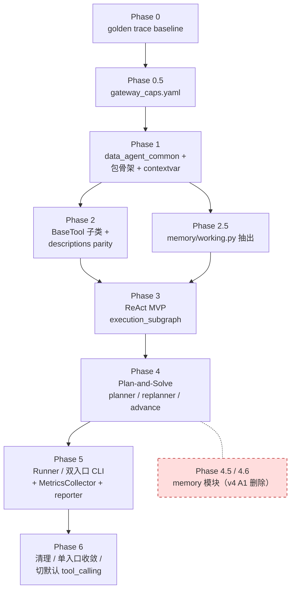

# LangGraph-first 重构方案 — `data_agent_refactored` → `data_agent_langchain`

> 目标：用 LangChain 标准化 LLM / Tool / Prompt，用 LangGraph 承接 Agent 状态机，同时保留 DABench 评测所需的 Runner、Trace、AnswerTable、任务隔离与底层工具安全逻辑。

> **v4 修订（2026-05-02）**：在 v3 基础上修复 review 指出的 5 处会破坏 parity 测试或制造死代码的硬伤（M1-M5），并对范围做了 3 处架构调整（A1-A3）。memory 跨 task 模块整章抽到独立提案 `MEMORY_MODULE_PROPOSAL.md`，主方案 Phase 数量从 7 降到 5。详见下方〇.1 节。
>
> **v3 修订（2026-04-30）**：在 v2 基础上补齐 9 处「与时间无关、与正确性有关」的设计漏洞，并对记忆模块、子图组装、工具抽象、可观测性做了架构层重排。修订要点见下方第〇章。

---

## 〇、修订摘要

### 0.1 v4 主要变更（在 v3 基础上）

| 编号 | 类别 | 变更 | 章节 |
|---|---|---|---|
| **M1** | 关键修复 | Gate L3 forced_inject 后 `skip_tool=False`、路由进入 `tool_node` 执行原 action；与基线 `_handle_gate_block` fall-through 一致（block + forced + 原 action 共 3 条 step）。v3 跳过原 action 会与 baseline 差 1 条 step | §7.4 / §16.1 |
| **M2** | 关键修复 | 新增 §9.2.1 `parse_action_node` 完整 I/O 契约：输入字段、错误出口、多 tool_calls 拒绝、不递增 step_index、与 gate_node / tool_node 透传衔接 | §9.2.1 |
| **M3** | 关键修复 | 替换 `bind_tools_safely` 的运行时 try/except 为 Phase 0.5 输出的 `gateway_caps.yaml` 配置驱动；CLI 启动前必验存在；新增 `observability/gateway_caps.py` | §11.1 / §15 / Phase 0.5 |
| **M4** | 关键修复 | MetricsCollector 业务事件解耦：业务节点用 LangGraph 0.4 `dispatch_custom_event(name, data, config=config)`；MetricsCollector 用 `on_custom_event` 订阅；删除 `record_*` 公共方法 | §11.5 / §20.2 / §20.4 |
| **M5** | 关键修复 | `advance_node` rule 5 加 `_REPLAN_TRIGGER_ERROR_KINDS = {tool_error, tool_timeout, tool_validation}` 白名单；避免 model_error / parse_error / unknown_tool 时误触发 replan | §10.3 |
| **A1** | 范围调整 | §19 跨 task memory 模块整章抽到 `MEMORY_MODULE_PROPOSAL.md` 独立提案；主方案仅保留 `memory/working.py`（单 run 内）。删除 Phase 4.5 / 4.6 | §3.2 / §15 / §17.3 / `MEMORY_MODULE_PROPOSAL.md` |
| **A2** | 范围调整 | CLI parity 期保留双入口 `dabench` + `dabench-lc`，yaml/CLI mismatch 硬错；Phase 6 才收敛为单入口 `dabench --backend ...`。否决 v3 D15 的 silent override | §13.4 / §15 |
| **A3** | 架构补齐 | 业务事件观察新增 §11.5：6 种事件名清单（gate_block / replan_triggered / replan_failed / parse_error / model_error / memory_recall）+ 必传 `config` 参数；§4.5 加 dispatch_custom_event 约束 | §4.5 / §11.5 |
| **E1** | 工程整洁 | `FALLBACK_STEP_PROMPT` 提到 `data_agent_common.constants`；新旧 backend 共享 + parity 字符串断言 | §3.1 / §10.3 |
| **E2** | 工程整洁 | `SANITIZE_ACTIONS` / `ERROR_SANITIZED_RESPONSE` 提到 `data_agent_common.agents.sanitize`；parity 字符串断言 | §3.1 / §10.4 |
| **E3** | 工程整洁 | 全文 Mac 风格 `@/Users/.../` 路径替换为项目相对路径 `src/data_agent_refactored/...` | 全文 |
| **E4** | 工程整洁 | 新增 §11.1.1 给出 `_call_model_with_retry` 完整骨架（max_retries=3 / backoff=(2,5,10) / timeout=120 与基线 `base_agent.py:48-106` 等价） | §11.1.1 |
| **E5** | 工程整洁 | `validate_eval_config` 调用时机明确：`from_yaml` / `from_dict` / CLI 入口都必调 | §11.4.5 |
| **E6** | 工程整洁 | Phase 0 golden trace fixture 规范：task_id 清单 / yaml hash / fake model 脚本 / 严格一致断言 | Phase 0 |
| **E7** | 工程整洁 | §15 顶部加 Phase 依赖图（Mermaid），明确 Phase 3 同时依赖 Phase 2 + 2.5 | §15.0 |
| **E8** | 工程整洁 | Runner `_build_initial_state` 必含 `dataset_root: str(config.dataset.root_path)`，配合 `_rehydrate_task` 单路径（D17） | §13.1 / §15 |
| **E9** | 工程整洁 | `BaseTool` 子类用 pydantic v2 `PrivateAttr() + model_post_init` 注入 `_task` / `_runtime`；删 `object.__setattr__` | §6.1.2 |
| **E10** | 工程整洁 | `ToolRuntime` 删 `allow_path_traversal` 字段；路径安全交给 `data_agent_common.tools.filesystem` 统一处理 | §6.1.1 |
| **E11** | 工程整洁 | `_LEGACY_DESCRIPTIONS["execute_python"]` 从 `data_agent_common.tools.python_exec` 导入 `EXECUTE_PYTHON_TIMEOUT_SECONDS` 常量；禁止硬编码 | §6.5.2 |
| **E12** | 工程整洁 | description parity 测试新增工具名集合断言 `sorted(_ALL_TOOL_NAMES) == sorted(legacy.specs.keys())` | §16.1 |
| **E13** | 工程整洁 | `AppConfig.to_dict() / from_dict()` round-trip 严格等价；子进程入口可序列化 | §13.1 / §15 |
| **E14** | 工程整洁 | `subgraph_exit` 字段定义统一在 §5.1，删除 §9.0 重复定义 | §5.1 / §9.0 |
| **E15** | 工程整洁 | 错误类型分离：`tool_validation`（参数校验）与 `tool_error`（运行期）拆为两种 `last_error_kind` 枚举 | §5.1 / §6.4 |

### 0.2 v3 主要变更（在 v2 基础上）

| 编号 | 类别 | 变更 | 章节 |
|---|---|---|---|
| **D1** | 关键修复 | LangSmith callback **只在 `compiled.invoke` 一处注入**；`ChatOpenAI` 不再单独注入 callbacks，避免重复事件 | §11.4.1 |
| **D2** | 关键修复 | `step_index` **由且仅由 `model_node` 在产生 LLM 响应后递增**；其余节点（parse / gate / tool / replanner）仅追加 `StepRecord`，不递增计数 | §5.4 / §9 / §10 |
| **D3** | 关键修复 | 显式定义 `ToolRuntime` dataclass（含 `context_dir` / `task_dir` / `python_timeout_s` / `sql_row_limit` 等纯字符串/数值字段），禁止包含闭包 | §6.1 |
| **D4** | 关键修复 | `AppConfig` **不通过 `RunnableConfig` 传递**；改由子进程入口注入到模块级 contextvar；`RunnableConfig` 仅放 `callbacks` / `run_name` / `configurable.thread_id` | §5.3 / §13.2 |
| **D5** | 关键修复 | `advance_or_replan_node` 显式定义 `can_replan = state["replan_used"] < cfg.max_replans`；并恢复旧版「计划用尽时追加 `_FALLBACK_STEP`」语义 | §10.3 |
| **D6** | 设计原则 | 新增 §4.5 评测确定性约束 / §4.6 同步实现为非目标 | §4.5 / §4.6 |
| **D7** | 架构重排 | Plan-and-Solve 与 ReAct 共享 `execution_subgraph`：执行循环作为 LangGraph 子图，外层只编排 plan / replan / finalize | §9 / §10 |
| **D8** | 架构重排 | 工具改为 `BaseTool` 子类（每工具一个文件），淘汰 `StructuredTool.from_function` 工厂；新增 §6.5 描述渲染 parity 测试 | §6.1 / §6.5 |
| **D9** | 架构重排 | 记忆模块重新设计：废除 `episodic`/`semantic` 名字，改为 `working` / `dataset_knowledge` / `tool_playbook` / `corpus`；写入层强制结构化字段，禁写自由文本；新增 `memory.mode` 三态开关，评测默认 `read_only_dataset` | §19 |
| **D10** | 架构重排 | 拆分 `MemoryStore`（KV）与 `Retriever`（检索）；BM25 / vector 索引作为独立 `Retriever` 子类，订阅 store 写入事件维护索引 | §19.3 |
| **D11** | 新增模块 | 新增 `observability/metrics.py`：`MetricsCollector` callback 写 per-task `metrics.json`（tokens / 工具计数 / wall clock） | §20（新增） |
| **D12** | 边界修正 | tool runtime 错误细分 `ToolRuntimeResult.error_kind`（`timeout` / `validation` / `runtime`）；`tool_node` 不再二次猜测错误类型 | §6.4 |
| **D13** | 边界修正 | `parallel_tool_calls=False` 在 `build_chat_model` 工厂内 try/except 兼容降级；网关不支持时由解析层显式拒绝多 tool_calls | §11.1 |
| **D14** | 边界修正 | `finalize_node` 必须保留旧版「Agent did not submit an answer within max_steps」失败文案；并新增 golden trace 等价性测试 | §9 / §16 |
| **D15** | 工程整洁 | CLI **单入口** `dabench --backend {refactored,langgraph}`，废弃 `dabench-lc`；`--backend` 必填 | §13.4 |
| **D16** | 工程整洁 | 删除 `observability/env.strip_langsmith_env`；统一通过 `config.observability.langsmith_enabled` 单一开关控制 | §11.4.2 |
| **D17** | 工程整洁 | `_rehydrate_task` 只保留单路径（`dataset_root + task_id`），删除「直接从 state 字段重建」备选 | §6.1 |

### v2 历史变更（保留供审阅）

| 编号 | 类别 | 变更 |
|---|---|---|
| C1 | 关键修复 | `RunState.steps` 必须使用 `Annotated[list, operator.add]` reducer，否则多节点写入会互相覆盖 |
| C2 | 关键修复 | `answer` 终止禁用 `return_direct=True`；改为自定义 `tool_node` 显式写 `state["answer"]` 并通过条件边路由到 `finalize_node`；工具内部不得 raise，统一返回 `ToolRuntimeResult(ok=False, ...)` |
| C3 | 关键修复 | Gate L3（强制注入 `list_context`）必须在 `gate_node` 内部直接调用工具，**短路 `tool_node`**，并自行追加 `StepRecord` |
| C4 | 关键约束 | 因启用 Checkpointer，`RunState` 必须 picklable：禁用 `Path`、`ToolRuntime` 闭包、compiled tools；改存原始字符串，每个节点入口现场重建工具 |
| C5 | 关键约束 | 因启用 LangSmith，新增 `observability/` 子模块；子进程必须显式继承 `LANGCHAIN_*` 环境变量；trace 客户端必须支持离线降级 |
| C6 | 默认值变更 | `agent.action_mode` 默认值改为 `json_action`；新增 Phase 0.5：评测网关 tool-calling 兼容性 smoke test |
| C7 | 工程结构 | 新增 `data_agent_common` 共享包，承载 `benchmark/` / `tools/{filesystem,python_exec,sqlite}.py` / `exceptions.py`，避免新旧两包重复维护 |
| C8 | 共存策略 | （v3 D15 修订）CLI 单入口 `dabench --backend ...`；`agent.backend` 必须显式设置，缺省时报错 |
| C9 | 工程明确 | `tool_calling` 模式下 `StepRecord.raw_response` 存 `AIMessage.tool_calls` 的 JSON；scratchpad 重建时反序列化为 `AIMessage(tool_calls=...)` |
| C10 | 工程明确 | `replanner_node` 必须保留 `__replan_failed__` / `__error__` 的 sanitization 协议，不能在迁移到 `agents/scratchpad.py` 时丢失 |
| C11 | 关键修复 | `RunState` 增加 `gate_decision` / `skip_tool` / `last_tool_*` 等显式路由字段，禁止条件边依赖 `steps[-1]` 猜测上一节点结果 |
| C12 | 关键修复 | （v3 D2 修订）`step_index` 由 `model_node` 单点递增 |
| C13 | 关键修复 | Discovery Gate 先作为可配置增强，parity 阶段默认只迁移旧版 Data Preview Gate；若开启路径约束，必须维护 `known_paths` |
| C14 | 工程明确 | （v3 D17 修订）`_rehydrate_task` 单路径：从 `dataset_root + task_id` 重新加载 |
| C15 | 工程明确 | `tool_calling` 模式必须禁止或显式拒绝多 tool calls；一次 LLM action 只能对应一条业务 `StepRecord` |
| C16 | 工程明确 | 不能只依赖 `ChatOpenAI.max_retries`；模型调用仍需项目级 retry-and-record 逻辑，以保留失败 trace |

---

## 一、结论先行

当前项目不是普通聊天 Agent，而是一个竞赛型 Data Agent。它有明显的业务语义：

1. 必须先发现 `context/` 文件，不能猜路径。
2. 计算和提交答案前必须预览数据。
3. `answer` 是终止工具，并且必须产出结构化 `AnswerTable`。
4. `trace.json` / `prediction.csv` 是评测产物，格式必须兼容。
5. Runner 需要任务级子进程隔离、批量并发、任务超时。
6. Plan-and-Solve 需要 planning、execution、replan、gate escalation、context trimming。

因此，推荐架构不是“简单用 `AgentExecutor` 替换手写循环”，而是：

```text
LangChain 负责：
  - ChatOpenAI / BaseChatModel
  - StructuredTool / 工具 schema
  - ChatPromptTemplate
  - 可选 LangSmith tracing

LangGraph 负责：
  - ReAct / Plan-and-Solve 状态机
  - gate / tool / replan / finalize 条件流转
  - 显式运行状态 RunState

项目自身继续负责：
  - AnswerTable / AgentRunResult / StepRecord 兼容输出
  - runner.py 子进程隔离与批量执行
  - 底层 filesystem / sqlite / python_exec 安全实现
  - DABench 数据集加载与 CLI
```

---

## 二、当前架构关键资产

### 2.1 应当保留的资产

| 模块 | 是否保留 | 原因 |
|------|----------|------|
| `benchmark/dataset.py` | 保留 | DABench 数据加载，与 Agent 框架无关 |
| `benchmark/schema.py` | 保留 | `PublicTask` / `AnswerTable` 是评测契约 |
| `run/runner.py` | 保留并适配 | 子进程隔离、批量并发、产物写盘不可替代 |
| `tools/filesystem.py` | 保留 | 已有路径安全与文件预览逻辑 |
| `tools/python_exec.py` | 保留 | Python 执行沙箱与超时是核心安全边界 |
| `tools/sqlite.py` | 保留 | read-only SQL 安全逻辑 |
| `config.py` | 保留并小幅扩展 | YAML 配置仍是项目入口 |
| `runtime.py` | 保留为兼容层 | `StepRecord` / `AgentRunResult` 是 trace schema 基础 |

### 2.2 可以重构的资产

| 现有模块 | 新实现 |
|----------|--------|
| `agents/model.py` | `llm/factory.py`，返回 LangChain `BaseChatModel` |
| `tools/registry.py` | `tools/factory.py` + 每工具一个 `BaseTool` 子类（v3 D8） |
| `agents/react_agent.py` | `agents/react_graph.py`，LangGraph ReAct 状态机 |
| `agents/plan_solve_agent.py` | `agents/plan_solve_graph.py`，LangGraph Plan-and-Solve 状态机 |
| `agents/prompt.py` | `agents/prompts.py`，`ChatPromptTemplate` + fallback JSON prompt |
| `agents/context_manager.py` | `agents/scratchpad.py`，保留 pin preview 的裁剪策略 |
| `agents/data_preview_gate.py` | `agents/gate.py`，作为 graph node，而不是 callback |
| `agents/json_parser.py` | fallback 模式保留；tool-calling 模式可减少依赖 |

---

## 三、目标目录结构

### 3.1 共享公共包 `data_agent_common`（v2 新增）

为避免新旧两套实现重复维护底层工具与评测 schema，**抽取一个 `data_agent_common` 包**，由新旧 Agent 共同依赖：

```text
src/data_agent_common/
├── __init__.py
├── constants.py               # v4 E1: FALLBACK_STEP_PROMPT；其他 byte-for-byte 共享字符串
├── exceptions.py              # 共享异常层次（DataAgentError / ToolError / ...）
├── benchmark/
│   ├── dataset.py             # DABench 数据加载
│   └── schema.py              # PublicTask / AnswerTable
├── agents/                     # v4 E1/E2: 共享给两个 backend 的 agent 原语
│   ├── runtime.py             # StepRecord / AgentRunResult / AgentRuntimeState
│   ├── json_parser.py         # parse_model_step / ModelResponseParseError
│   └── sanitize.py            # SANITIZE_ACTIONS / ERROR_SANITIZED_RESPONSE
└── tools/
    ├── filesystem.py          # 路径安全 + 文件预览
    ├── python_exec.py         # Python 执行沙箱（含 EXECUTE_PYTHON_TIMEOUT_SECONDS 常量，v4 E11）
    └── sqlite.py              # read-only SQL
```

迁移姿势：

- 把 `data_agent_refactored/{exceptions,benchmark,tools/{filesystem,python_exec,sqlite}}.py` 移到 `data_agent_common/`，保持 API 不变。
- **v4 E1/E2**：`data_agent_refactored/agents/{runtime,json_parser,context_manager}.py` 中的 `StepRecord`、`AgentRunResult`、`parse_model_step`、`SANITIZE_ACTIONS`、`ERROR_SANITIZED_RESPONSE`、`FALLBACK_STEP_PROMPT` 提到 `data_agent_common.agents.{runtime,json_parser,sanitize}`；`data_agent_refactored/agents/context_manager.py` 改为 thin re-export。新增 parity 测试：`assert FALLBACK_STEP_PROMPT == "Call the answer tool with the final result table."`、`assert SANITIZE_ACTIONS == frozenset({"__error__", "__replan_failed__"})`。
- 在 `data_agent_refactored/` 与 `data_agent_langchain/` 中改为 `from data_agent_common import ...`。
- 旧版的 `data_agent_refactored/tools/{registry,handlers}.py` 仅保留旧式 ToolRegistry 注册逻辑；新版 `data_agent_langchain/tools/` 下每工具一个 `BaseTool` 子类（v3 D8），复用 common 的底层函数。

### 3.2 新包目录结构 `data_agent_langchain`

```text
src/data_agent_langchain/
├── __init__.py
├── config.py
├── cli.py
├── exceptions.py              # 仅 langchain/langgraph 特定异常；通用异常已迁至 data_agent_common
│
├── runtime/
│   ├── __init__.py
│   ├── result.py              # StepRecord / AgentRunResult 兼容定义
│   └── state.py               # LangGraph RunState / AgentState（picklable）
│
├── llm/
│   ├── __init__.py
│   └── factory.py             # build_chat_model(config) -> BaseChatModel
│
├── observability/             # LangSmith 集成 + 离线指标 + 网关能力探测
│   ├── __init__.py
│   ├── tracer.py              # build_callbacks(config, task_id, mode)
│   ├── metrics.py             # v3 新增：MetricsCollector callback，写 metrics.json；v4 M4 改用 on_custom_event
│   ├── gateway_caps.py        # v4 M3 新增：GatewayCaps dataclass + Phase 0.5 smoke test 输出
│   └── reporter.py            # v3 新增：批量 metrics 聚合
│
├── tools/                      # v3 修订：每工具一个 BaseTool 子类（见 §6.1）
│   ├── __init__.py
│   ├── tool_runtime.py        # ToolRuntime / ToolRuntimeResult / 超时包装
│   ├── descriptions.py        # v3 新增：与旧 ToolSpec 字符级一致的 description 渲染
│   ├── list_context.py        # ListContextTool(BaseTool)
│   ├── read_csv.py            # ReadCsvTool(BaseTool)
│   ├── read_json.py           # ReadJsonTool(BaseTool)
│   ├── read_doc.py            # ReadDocTool(BaseTool)
│   ├── inspect_sqlite_schema.py
│   ├── execute_context_sql.py
│   ├── execute_python.py
│   ├── answer.py              # AnswerTool(BaseTool)，写 ToolRuntimeResult.is_terminal=True
│   └── factory.py             # create_all_tools(task, runtime) -> list[BaseTool]
│
├── memory/                     # v4 A1 缩减：仅保留 working.py，跨 task 能力抽到独立提案
│   ├── __init__.py
│   └── working.py              # Run-Working：scratchpad / pin 数据预览 / sanitize（单 run 内）
│   # 以下子模块已抽到 MEMORY_MODULE_PROPOSAL.md，待该提案独立通过后再加：
│   #   - base.py / records.py / dataset_knowledge.py / tool_playbook.py
│   #   - policies.py / factory.py / writers.py
│   #   - stores/{jsonl,sqlite}.py
│   #   - retrievers/{exact,recency}.py
│
├── agents/
│   ├── __init__.py
│   ├── prompts.py             # ChatPromptTemplate / fallback JSON prompt
│   ├── parse_action.py        # v4 M2 新增：parse_action_node 完整契约（见 §9.2.1）
│   ├── scratchpad.py          # thin re-export：from data_agent_langchain.memory.working import ...
│   ├── gate.py                # discovery + data preview gate；含 L3 短路逻辑
│   ├── execution_subgraph.py  # v3 新增：model→parse→gate→tool→advance 内层循环（ReAct/PS 共用）
│   ├── react_graph.py         # LangGraph ReAct（外层只是「单 plan 步」包装 execution_subgraph）
│   ├── plan_solve_graph.py    # LangGraph Plan-and-Solve（外层 plan/replan/finalize + execution_subgraph）
│   └── finalize.py            # RunState -> AgentRunResult（含 max_steps 失败文案）
│
└── run/
    └── runner.py              # 适配新 Agent 接口；子进程隔离 + 写盘 + AppConfig 注入
```

> v3 → v4 关键变化：
> - **v4 A1**：`memory/` 仅保留 `working.py`（refactor，不新增跨 task 能力）；其余跨 task 子模块迁至 `MEMORY_MODULE_PROPOSAL.md` 独立提案，避免污染 parity 测试。
> - **v4 M3**：新增 `observability/gateway_caps.py`（Phase 0.5 smoke test 输出），替代运行时 try/except 的网关降级。
> - **v4 M2**：新增 `agents/parse_action.py`，给出 `parse_action_node` 完整 I/O 契约（见 §9.2.1）。
> - **v3 D8**：`tools/` 由「单文件工厂」改为「每工具一个 `BaseTool` 子类」。
> - **v3 D7**：`agents/execution_subgraph.py` 是抽出的可复用子图。
> - **v3 D11**：`observability/metrics.py` 是离线指标 callback（v4 M4 进一步解耦为 `on_custom_event` 订阅）。
> - **v3 D16**：`observability/env.py` 已删除，评测开关由 `config.observability.langsmith_enabled` 单点控制。

---

## 四、核心设计原则

### 4.1 不让 LangChain 决定评测输出格式

`trace.json` 和 `prediction.csv` 是项目契约，不应由 LangChain callback 的事件格式决定。

保留兼容对象：

```python
StepRecord
AgentRuntimeState
AgentRunResult
AnswerTable
```

LangGraph 的每个节点只负责更新 state，最终统一由 `finalize_run_result()` 生成兼容输出。

### 4.2 不用 Callback 控制业务流程

Callback 只适合：

- LangSmith tracing
- 日志
- token 统计
- 调试可视化

Callback 不适合实现：

- 数据预览门控
- answer 终止
- 重规划
- 强制注入 `list_context`

这些必须是 LangGraph graph node 或 tool wrapper 中的显式逻辑。

### 4.3 Tool-calling 与 JSON fallback 双模式（v2 修订）

两种模式都要支持：

```text
tool_calling:  ChatOpenAI.bind_tools(tools)，模型直接输出 tool_calls
json_action:   模型输出 {"thought", "action", "action_input"} fenced JSON，复用 json_parser 容错解析
```

**v2 默认配置**：

```yaml
agent:
  action_mode: json_action   # json_action（默认） | tool_calling
```

**默认值改为 `json_action` 的原因**：

- 评测网关是否完整支持 OpenAI tool-calling 在迁移当时未知（包括 `parallel_tool_calls`、`tool_choice="required"`、`strict=true`）。
- 一旦上线那天才发现网关吐 `400 Unknown parameter: 'tools'`，回滚成本高。
- `json_action` 在旧 baseline 已稳定运行，是更安全的默认值。

**Phase 0.5 强制项**：在切换默认值之前，先用最小脚本对评测网关跑 `bind_tools()` smoke test（见第十五章）。tool-calling 全面通过后再考虑把默认值切到 `tool_calling`。

### 4.4 保留任务级与工具级超时

不能只依赖 `AgentExecutor.max_execution_time`。

必须保留三层超时：

| 层级 | 实现 |
|------|------|
| 模型请求超时 | `ChatOpenAI(request_timeout=...)` |
| 单工具超时 | `tool_runtime.call_tool_with_timeout(...)` |
| 单任务超时 | `runner.py` 子进程 timeout |

### 4.5 评测确定性约束（v3 新增 / D6）

评测 run 必须 deterministic，否则 parity 不可比、回归不可定位。

**强制约束**：

```yaml
evaluation:
  reproducible: true              # 评测模式必须开启
```

`reproducible=true` 时下列实现细节是**强约束**：

| 项 | 约束 |
|---|---|
| LangGraph 调用方式 | 只用 `compiled.invoke(...)`；禁止 `compiled.stream(...)` 与 `astream` |
| 节点并行 | 不使用并行分支（fan-out fan-in）；所有 `add_edge` / `add_conditional_edges` 必须保持顺序拓扑 |
| Checkpointer | 评测默认 `none`；启用时必须 `MemorySaver`，禁止 `SqliteSaver`（避免磁盘 I/O 影响 wall-clock） |
| LangSmith | `langsmith_enabled=false`，callback 列表为空 |
| Metrics callback | 允许，但 `MetricsCollector` 不得改动 state |
| 工具异步 | 所有工具走 `_run`；禁用 `_arun` |
| 模型 seed | 网关支持时显式传 `seed=int(config.agent.seed)`；不支持时记录 warning，不阻断 |
| Reducer | `Annotated[list, operator.add]` 在串行执行下顺序稳定；不要替换为 set / dict reducer |
| **业务事件**（v4 A3） | `dispatch_custom_event(name, data, config=config)` 必传 `config` 参数；MetricsCollector 只订阅（§11.5 / §20.4）不改 state。禁止在业务节点中 `isinstance(cb, MetricsCollector)` 反向调用。 |
| **GatewayCaps**（v4 M3） | `reproducible=true` 且 `seed_param=false` 时，`validate_eval_config` 报错；避免静默丢 seed 后输出不可复现 |

**dev 模式**（`reproducible=false`）允许 streaming / LangSmith / SqliteSaver 用于调试。

### 4.6 同步实现为非目标（v3 新增 / D6）

LangChain 提供 `ainvoke` / `_arun` 等异步 API，但本项目坚持同步实现：

- 任务级隔离已通过 `multiprocessing.Process` 解决，不是 web 服务，没有 fan-out 收益。
- `execute_python` 沙箱必须同步以便用 `concurrent.futures.ThreadPoolExecutor` 强制超时；async 路径会绕过该控制。
- 工具描述、上下文窗口管理、错误恢复等业务逻辑同步实现成本最低。

工程约束：

- 所有 `BaseTool` 子类**只重写 `_run`**，不实现 `_arun`。父类默认 `_arun` 会向同步 fallback，OK。
- `compiled.invoke(...)` 是唯一调用方式（与 §4.5 一致）。
- `model_node` 内部调用 `llm.invoke(...)`，**不要** `llm.ainvoke(...)`。

如未来需要 batched concurrency，应在 `runner.py` 层用 `ThreadPoolExecutor` / `multiprocessing.Pool` 解决，**不引入 asyncio**。

---

## 五、RunState 设计（v2 修订）

LangGraph 的状态应显式表达现有 Agent 语义。**v2 关键变化**：

1. `steps` 字段必须用 `Annotated[list, operator.add]` 声明 reducer，否则多节点 append 会互相覆盖（C1）。
2. 因启用 Checkpointer，整个 RunState 必须 picklable：禁止存 `Path`、`ToolRuntime` 实例、`BaseTool` 子类实例 等含闭包对象（C4）。
3. 工具与 runtime 改为**每个节点入口根据 state 现场重建**（见 6.1）。

### 5.1 RunState 定义

```python
import operator
from typing import Annotated, Any, Literal, TypedDict

from data_agent_common.benchmark.schema import AnswerTable
from data_agent_langchain.runtime.result import StepRecord


class RunState(TypedDict, total=False):
    # ----- 任务标识（picklable: 全部基本类型） -----
    task_id: str
    question: str
    difficulty: str
    dataset_root: str              # 可选：用于从 dataset_root + task_id 重新加载 task
    task_dir: str                  # str 而非 Path，便于 pickle
    context_dir: str               # str 而非 Path，便于 pickle

    # ----- 模式与 action 模式 -----
    mode: Literal["react", "plan_solve"]
    action_mode: Literal["tool_calling", "json_action"]

    # ----- 规划阶段 -----
    plan: list[str]
    plan_index: int
    replan_used: int

    # ----- 步骤累积（关键：必须用 reducer） -----
    steps: Annotated[list[StepRecord], operator.add]

    # ----- 终止与失败 -----
    answer: AnswerTable | None     # AnswerTable 是 frozen dataclass，picklable
    failure_reason: str | None

    # ----- 门控 -----
    discovery_done: bool
    preview_done: bool
    known_paths: list[str]          # Discovery Gate 开启时维护；parity 默认可为空
    consecutive_gate_blocks: int
    gate_decision: Literal["pass", "block", "forced_inject"]
    skip_tool: bool                 # True 表示 gate 已自行处理，条件边不得进入 tool_node

    # ----- 当前一轮缓存（每轮 model_node 写入，下游节点消费） -----
    raw_response: str              # tool_calling 模式存 tool_calls JSON；json_action 模式存模型原文
    thought: str
    action: str
    action_input: dict[str, Any]

    # ----- 上一动作结果（供条件边读取；不要从 steps[-1] 猜） -----
    last_tool_ok: bool | None
    last_tool_is_terminal: bool
    last_error_kind: Literal[
        "parse_error",
        "unknown_tool",
        "tool_timeout",
        "tool_validation",          # v4 E15: pydantic schema / 工具上报的参数问题（与 tool_error 分开）
        "tool_error",               # 工具运行期异常
        "model_error",
        "gate_block",
        "max_steps_exceeded",       # v3 D2：model_node 检测 step_index > max_steps 时使用
    ] | None

    # ----- 子图退出语义（v3 D7 新增） -----
    subgraph_exit: Literal["continue", "done", "replan_required"]

    # ----- 计数 -----
    step_index: int
    max_steps: int
```

### 5.2 字段语义

- `discovery_done`：是否成功执行过 `list_context`。
- `preview_done`：是否成功执行过 `read_csv` / `read_json` / `read_doc` / `inspect_sqlite_schema`。
- `known_paths`：Discovery Gate 开启时由 `list_context` / 文件预览工具维护；parity 阶段默认不强制路径必须来自该集合。
- `answer`：**只能由 `tool_node` 在执行 `answer` 工具且 `is_terminal=True` 后写入**，graph 通过条件边路由到 `finalize_node`。
- `steps`：始终按原 `StepRecord` schema 记录；每个 node 只能 **append**，由 reducer 合并；不能 in-place 修改。
- `consecutive_gate_blocks`：连续被 gate 阻断次数；L3 触发后由 `gate_node` 重置为 0。
- `gate_decision` / `skip_tool`：graph 条件边的唯一依据。L3 forced inject 后必须设置 `gate_decision="forced_inject"` 与 `skip_tool=True`，避免误进 `tool_node`。
- `last_tool_ok` / `last_tool_is_terminal` / `last_error_kind`：供 `route_node` / `advance_or_replan_node` 决策，禁止依赖 `steps[-1]` 推断上一节点结果。

### 5.3 Picklability 约束（C4 / v3 D4 修订）

`SqliteSaver` 与 `MemorySaver` 都依赖 pickle 序列化整个 state。下列对象**禁止入 RunState**：

| 禁止字段 | 原因 | 替代方案 |
|---|---|---|
| `Path` | pathlib.Path 在 Win/Linux 跨平台 unpickle 不稳 | 改存 `str`，节点入口 `Path(state["context_dir"])` |
| `ToolRuntime` 实例 | 含 task / runtime 闭包（v3 D3 已改为 picklable dataclass，但仍**不入 state**，由节点入口构造以保持 state 简洁） | 节点入口 `_build_runtime(state, app_config)` |
| `list[BaseTool]` | tool 子类实例闭包了 `task` / `runtime`，不保证可 pickle | 节点入口 `tool_factory.create_all_tools(task, runtime)` |
| `BaseChatModel` 实例 | 部分 client（含 httpx）含锁/连接池 | 节点入口 `llm.factory.build_chat_model(app_config)` |
| `PublicTask` 实例 | 含 `Path` 字段 | 拆为 `task_id` / `question` / `difficulty` / `task_dir: str` / `context_dir: str`；v3 D17：节点入口必须用 `dataset_root + task_id` 重新加载 |
| **`AppConfig` 实例（v3 D4 新增）** | 可能含 `Path` / 嵌套 dataclass / lambda；通过 `RunnableConfig.configurable` 传递时会被 pickle | **不通过 `RunnableConfig` 传递**；改为子进程入口注入到模块级 contextvar，节点用 `get_current_app_config()` 读取 |

**v3 D4 — `AppConfig` 注入路径修正**：

```python
# data_agent_langchain/runtime/context.py
from contextvars import ContextVar
from data_agent_langchain.config import AppConfig

_APP_CONFIG: ContextVar[AppConfig | None] = ContextVar("app_config", default=None)

def set_current_app_config(cfg: AppConfig) -> None:
    _APP_CONFIG.set(cfg)

def get_current_app_config() -> AppConfig:
    cfg = _APP_CONFIG.get()
    if cfg is None:
        raise RuntimeError("AppConfig not initialized; subprocess entry must call set_current_app_config().")
    return cfg
```

```python
# data_agent_langchain/run/runner.py - 子进程入口
def _run_single_task_in_subprocess(task_id, config_dict, result_queue, ...):
    config = AppConfig.from_dict(config_dict)        # 子进程内重建（picklable dict）
    set_current_app_config(config)                    # 模块级 contextvar 注入

    graph = build_plan_solve_graph(config)
    compiled = graph.compile(checkpointer=_resolve_checkpointer(config))

    final_state = compiled.invoke(
        initial_state,
        config={
            "callbacks": build_callbacks(config, task_id=task_id, mode="plan_solve"),
            "run_name": f"plan_solve:{task_id}",
            "configurable": {"thread_id": task_id},   # 仅 LangGraph 自身需要的字段
        },
    )
```

`RunnableConfig` 仅承载 LangGraph 自身需要的三类字段：`callbacks` / `run_name` / `configurable.thread_id`，**业务 config 不入 `RunnableConfig`**。

**节点重建模板**：

```python
def model_node(state: RunState, config: RunnableConfig) -> dict[str, Any]:
    app_config = get_current_app_config()             # contextvar 读取
    task = _rehydrate_task(state)                     # 单路径：dataset_root + task_id
    runtime = _build_runtime(task, app_config)
    tools = create_all_tools(task, runtime)
    llm = build_chat_model(app_config)
    if state.get("action_mode") == "tool_calling":
        llm = llm.bind_tools(tools, parallel_tool_calls=False)
    ...
```

这意味着每个节点入口都有少量重建开销（μs 级，远低于 LLM 调用成本），换取完整 checkpointer 兼容。

### 5.4 执行步计数规则（v3 D2 修订）

旧版 `PlanAndSolveAgent.run()` 的 `for step_index in range(1, max_steps + 1)` 语义必须保留。**v3 修订：`step_index` 由且仅由 `model_node` 在产生 LLM 响应（成功或失败）后递增一次**，其他节点不递增。这是为了消除 v2 中「parse / gate / tool 谁来递增」的歧义。

实现规则：

| 节点 | 是否递增 `step_index` | 备注 |
|---|---|---|
| `model_node` | **递增 1 次**（在 LLM 调用结束后，无论成功 / 失败 / 重试用尽） | 同一次 LLM 调用 attempt 只算一步 |
| `parse_action_node` | 不递增 | 解析失败追加 `__error__` step，但「模型已说话」已被 `model_node` 计数 |
| `gate_node` | 不递增 | gate block / forced inject 都已被 `model_node` 计数 |
| `tool_node` | 不递增 | unknown tool / timeout / 工具失败都已被 `model_node` 计数 |
| `replanner_node` | 不递增 | replan 是「计划级」操作，不消耗执行步配额 |
| `planner_node` | 不递增 | 规划阶段不属于执行循环 |

**model_node 实现骨架**（v3 标准）：

```python
def model_node(state: RunState, config: RunnableConfig) -> dict[str, Any]:
    app_config = get_current_app_config()
    cur_step = state.get("step_index", 0) + 1

    if cur_step > state.get("max_steps", app_config.agent.max_steps):
        # 达到上限，由后续条件边路由到 finalize_node
        return {"step_index": cur_step, "last_error_kind": "max_steps_exceeded"}

    try:
        raw, action_payload = _call_model_with_retry(state, app_config)
    except ModelExhaustedError as exc:
        return {
            "step_index": cur_step,
            "steps": [_model_error_record(state, cur_step, exc)],
            "last_tool_ok": False,
            "last_error_kind": "model_error",
            "raw_response": "",
        }

    return {
        "step_index": cur_step,
        "raw_response": raw,
        # parse_action_node 接力解析 raw -> thought / action / action_input
    }
```

**条件边判断 `max_steps`**：在 `route_node` / `advance_or_replan_node` 中读取 `state["step_index"] >= state["max_steps"]`，路由到 `finalize_node`。

**与 v2 C12 的区别**：v2 描述了「每次 action 消耗一步」的语义，但没说由哪个节点递增；v3 D2 把递增权收归 `model_node`，使得 parse / gate / tool 三个节点可以在重试 / 重路由场景下被反复进入而不污染计数。

---

## 六、工具层迁移方案

### 6.1 工具实现：`BaseTool` 子类（v3 D8 修订）

**v3 关键变化**：放弃 `StructuredTool.from_function` 工厂，改为「每工具一个 `BaseTool` 子类」。理由：
- 每个工具可单测（`pytest tests/tools/test_list_context.py`）
- schema / description / 实现内聚在一个文件
- 子类可重写 `_run` / `_arun` / 自定义 `format_tool_to_openai_function`
- 便于将来加「工具级中间件」（retry / 日志 / 指标 / cache）

#### 6.1.1 `ToolRuntime` 显式数据结构（v3 D3 新增）

`ToolRuntime` 是工具执行所需的**纯数据上下文**，要求 picklable：

```python
# data_agent_langchain/tools/tool_runtime.py
from __future__ import annotations
from dataclasses import dataclass

@dataclass(frozen=True, slots=True)
class ToolRuntime:
    """Picklable runtime context shared by all tools within a task.

    Strictly typed; **no closures, no Path, no callable fields**.
    v4 E10: 删除 allow_path_traversal 字段——路径安全交给 data_agent_common.tools.filesystem
    统一处理，runtime 不传策略。
    """
    task_dir: str                  # str path（节点入口转 Path）
    context_dir: str               # str path
    python_timeout_s: float        # execute_python 超时
    sql_row_limit: int             # execute_context_sql 默认行数上限
    max_obs_chars: int             # 观察结果裁剪阈值


@dataclass(frozen=True, slots=True)
class ToolRuntimeResult:
    """Standardized tool return value."""
    ok: bool
    content: dict[str, Any]
    is_terminal: bool = False
    answer: AnswerTable | None = None
    # v3 D12 + v4 E15: error_kind 区分 timeout / validation / runtime 三种；
    # tool_node 将之映射到 last_error_kind={tool_timeout, tool_validation, tool_error}。
    error_kind: Literal["timeout", "validation", "runtime"] | None = None
```

`ToolRuntime` 的字段全部是基本类型；节点入口构造它的开销 < 1μs。

#### 6.1.2 `BaseTool` 子类样板

每个工具一个文件，`tools/list_context.py` 为例：

```python
# data_agent_langchain/tools/list_context.py
from __future__ import annotations
from pathlib import Path
from typing import ClassVar

from langchain_core.tools import BaseTool
from pydantic import BaseModel, ConfigDict, Field, PrivateAttr

from data_agent_common.benchmark.schema import PublicTask
from data_agent_common.tools.filesystem import list_context_tree
from data_agent_langchain.tools.tool_runtime import ToolRuntime, ToolRuntimeResult
from data_agent_langchain.tools.descriptions import render_legacy_description


class ListContextInput(BaseModel):
    """Input schema. Pydantic v2."""
    model_config = ConfigDict(extra="forbid")
    max_depth: int = Field(default=4, ge=1, le=10, description="Maximum recursion depth.")


class ListContextTool(BaseTool):
    name: str = "list_context"
    description: str = render_legacy_description("list_context")   # v3 D8 / §6.5
    args_schema: type[BaseModel] = ListContextInput
    return_direct: ClassVar[bool] = False                          # 显式禁用（C2）

    # v4 E9: pydantic v2 正确用法是 PrivateAttr + model_post_init；
    # frozen 模型下 object.__setattr__ 会抱 ValidationError。
    _task: PublicTask = PrivateAttr()
    _runtime: ToolRuntime = PrivateAttr()

    def __init__(self, *, task: PublicTask, runtime: ToolRuntime, **kwargs):
        super().__init__(**kwargs)
        self._task = task
        self._runtime = runtime

    def _run(self, max_depth: int) -> ToolRuntimeResult:
        try:
            tree = list_context_tree(
                Path(self._runtime.context_dir), max_depth=max_depth,
            )
        except Exception as exc:
            return ToolRuntimeResult(
                ok=False,
                content={"error": str(exc), "tool": self.name},
                error_kind="runtime",
            )
        return ToolRuntimeResult(ok=True, content={"tree": tree})

    # 不实现 _arun（§4.6）
```

`AnswerTool` 是终止工具，但**不使用 `return_direct=True`**（C2）；终止由 `tool_node` 通过 `state["answer"]` 显式写入并由条件边路由。

#### 6.1.3 工厂

```python
# data_agent_langchain/tools/factory.py
from langchain_core.tools import BaseTool
from .list_context import ListContextTool
from .read_csv import ReadCsvTool
# ... 其他 import

def create_all_tools(task: PublicTask, runtime: ToolRuntime) -> list[BaseTool]:
    """Build a fresh task-scoped tool set. Called at each node entry."""
    return [
        ListContextTool(task=task, runtime=runtime),
        ReadCsvTool(task=task, runtime=runtime),
        ReadJsonTool(task=task, runtime=runtime),
        ReadDocTool(task=task, runtime=runtime),
        InspectSqliteSchemaTool(task=task, runtime=runtime),
        ExecuteContextSqlTool(task=task, runtime=runtime),
        ExecutePythonTool(task=task, runtime=runtime),
        AnswerTool(task=task, runtime=runtime),
    ]
```

#### 6.1.4 任务重建（v3 D17 单路径）

`_rehydrate_task` 只保留 `dataset_root + task_id` 单路径，删除「直接从 state 字段重建」的备选。原因：避免双路径 schema 漂移。

```python
# data_agent_langchain/runtime/rehydrate.py
from pathlib import Path
from data_agent_common.benchmark.dataset import DABenchPublicDataset
from data_agent_common.benchmark.schema import PublicTask
from data_agent_langchain.runtime.context import get_current_app_config

def _rehydrate_task(state: RunState) -> PublicTask:
    """Single-path task reconstruction. Subprocess must guarantee dataset_root in state."""
    dataset_root = state.get("dataset_root")
    if not dataset_root:
        raise RuntimeError(
            "_rehydrate_task requires state['dataset_root']; "
            "runner must populate it in initial_state."
        )
    return DABenchPublicDataset(Path(dataset_root)).get_task(state["task_id"])

def _build_runtime(task: PublicTask, app_config: AppConfig) -> ToolRuntime:
    return ToolRuntime(
        task_dir=str(task.assets.task_dir),
        context_dir=str(task.assets.context_dir),
        python_timeout_s=app_config.tools.python_timeout_s,
        sql_row_limit=app_config.tools.sql_row_limit,
        max_obs_chars=app_config.agent.max_obs_chars,
    )
```

**工具创建是轻量的**（不打开文件 / 不连数据库 / 不 fork 子进程），μs 级，与 LLM 调用相比可忽略。

### 6.2 工具返回值分层

工具需要同时满足两类消费方：

1. LLM 看到的 observation（`content` 字段，序列化为字符串）。
2. 项目内部 trace / answer artifact（结构化 `ToolRuntimeResult`）。

`ToolRuntimeResult` 的定义见 §6.1.1（含 `error_kind` 字段，v3 D12 新增）。

LLM 可见内容由 `tool_node` 渲染：成功时序列化 `content`；失败时拼接 `content.error` + `error_kind` 提示词。但 graph state 中始终保留结构化对象（StepRecord.observation）。

### 6.3 `answer` 工具与终止机制（v3 修订）

**禁止使用 `return_direct=True`**（C2）：它只让 `AgentExecutor` 短路，但 LangGraph 自定义图里没有这个语义；并且会丢失结构化 `AnswerTable`。

正确实现：

1. `AnswerTool._run`：校验 `columns` / `rows`，构造 `AnswerTable`，返回 `ToolRuntimeResult(ok=True, is_terminal=True, answer=...)`。
2. **自定义 `tool_node`**（不要用 prebuilt `ToolNode`，它只返回 `ToolMessage` 不会写 state）：
   ```python
   def tool_node(state: RunState, config: RunnableConfig) -> dict[str, Any]:
       app_config = get_current_app_config()
       task = _rehydrate_task(state)
       runtime = _build_runtime(task, app_config)
       tools = {t.name: t for t in create_all_tools(task, runtime)}
       tool = tools.get(state["action"])
       if tool is None:
           result = ToolRuntimeResult(
               ok=False,
               content={"error": f"Unknown tool: {state['action']}"},
               error_kind="validation",
           )
           return {
               "steps": [_record_from(state, result)],
               "last_tool_ok": False,
               "last_tool_is_terminal": False,
               "last_error_kind": "unknown_tool",
           }
       result: ToolRuntimeResult = call_tool_with_timeout(
           tool, state["action_input"], app_config.agent.tool_timeout_s,
       )
       # v3 D12 + v4 E15: error_kind 由工具返回，tool_node 依据三种原始 error_kind 映射。
       # 区分 tool_validation（pydantic schema 校验／工具上报的参数问题）与 tool_error（运行期异常），
       # 便于 advance_node rule 5 白名单（v4 M5: _REPLAN_TRIGGER_ERROR_KINDS）精细控制 replan 触发。
       update: dict[str, Any] = {
           "steps": [_record_from(state, result)],
           "last_tool_ok": result.ok,
           "last_tool_is_terminal": result.is_terminal,
           "last_error_kind": (
               None if result.ok else
               {
                   "timeout": "tool_timeout",
                   "validation": "tool_validation",   # v4 E15: 不再同 tool_error 混为一谈
                   "runtime": "tool_error",
               }[result.error_kind or "runtime"]
           ),
       }
       if result.is_terminal and result.answer is not None:
           update["answer"] = result.answer       # 显式写 state
       if result.ok and state["action"] in DATA_PREVIEW_ACTIONS:
           update["preview_done"] = True
       if result.ok and state["action"] == "list_context":
           update["discovery_done"] = True
           update["known_paths"] = _merge_known_paths(state, result)
       return update
   ```
3. **条件边**判断 `state.get("answer") is not None` → 路由到 `finalize_node`，否则回到 `model_node`。
4. `finalize_node` 由 RunState 生成 `AgentRunResult`，由 runner 写 `prediction.csv` / `trace.json`。

### 6.4 工具异常处理（v3 D12 修订）

**所有工具必须不 raise，统一返回 `ToolRuntimeResult(ok=False, content={"error": ...}, error_kind=...)`**（C2 + D12）：

| 异常来源 | 由谁捕获 | 转换 |
|---|---|---|
| 路径越界 / 文件不存在 / SQL 违规 / Python 沙箱内部异常 | 工具子类的 `_run` | `ok=False, error_kind="runtime"` |
| 工具超时 | `call_tool_with_timeout` 包装层 | `ok=False, error_kind="timeout"` |
| pydantic schema 校验错误 | `BaseTool.invoke` 包装层 | `ok=False, error_kind="validation"` |
| Unknown tool（`state["action"]` 不在 `tools` 中） | `tool_node` 自身 | `ok=False, error_kind="validation"`，`last_error_kind="unknown_tool"` |

**v3 D12 关键变化**：`tool_node` 不再通过观察 `result.ok` + 工具名字猜错误类型；`error_kind` 由工具 / 包装层在源头打标，`tool_node` 仅做语义映射（`tool_error` / `tool_timeout`）。

**为什么必须如此**：LangGraph 默认会让工具异常一路抛到 `compiled.invoke`，绕过项目自己的 `StepRecord` 记录逻辑，导致 trace 缺失这一步。当前 `BaseAgent._validate_and_execute_tool` 已经在做这个事（捕获 `TimeoutError` 后写 `StepRecord`），LangGraph 实现不能丢这个语义。

### 6.5 工具描述 parity 渲染（v3 D8 新增）

LangChain 的 `BaseTool.description` 在 tool-calling 模式下会被序列化为 OpenAI function spec；在 `json_action` 模式下又会被项目代码拼到 system prompt。**两种模式下喂给 LLM 的描述格式不同**，会导致输出分布漂移，`json_action` 模式 parity 测试会失败而不易归因。

#### 6.5.1 老版本描述格式（基线）

旧 `ToolRegistry.describe_for_prompt` 输出（见 `src/data_agent_refactored/tools/registry.py:86-93`）：

```text
- list_context: List files and directories available under context.
  input_schema: {'max_depth': 4}
- read_csv: Read a preview of a CSV file inside context.
  input_schema: {'path': 'relative/path/to/file.csv', 'max_rows': 20}
...
```

#### 6.5.2 v3 处理方案

把老格式集中到 `tools/descriptions.py`，由 `BaseTool.description` 字段引用，确保 `json_action` 模式下输出与旧版**字符级一致**：

```python
# data_agent_langchain/tools/descriptions.py
"""Tool description registry. The single source of truth that keeps
new BaseTool subclasses' description byte-for-byte equivalent to the
legacy ToolRegistry.describe_for_prompt() output."""

from typing import Any
from data_agent_common.tools.python_exec import EXECUTE_PYTHON_TIMEOUT_SECONDS    # v4 E11

_LEGACY_DESCRIPTIONS: dict[str, dict[str, Any]] = {
    "list_context": {
        "description": "List files and directories available under context.",
        "input_schema": {"max_depth": 4},
    },
    "read_csv": {
        "description": "Read a preview of a CSV file inside context.",
        "input_schema": {"path": "relative/path/to/file.csv", "max_rows": 20},
    },
    # v4 E11: execute_python 描述里嵌入了运行时常量 EXECUTE_PYTHON_TIMEOUT_SECONDS，
    # 必须从 data_agent_common.tools.python_exec 导入同一个常量；
    # 切忌硬编码字面值（基线 src/data_agent_refactored/tools/registry.py:153-157）。
    "execute_python": {
        "description": (
            "Execute arbitrary Python code with the task context directory as the "
            "working directory. The tool returns the code's captured stdout as `output`. "
            f"The execution timeout is fixed at {EXECUTE_PYTHON_TIMEOUT_SECONDS} seconds."
        ),
        "input_schema": {
            "code": "import os\nprint(sorted(os.listdir('.')))",
        },
    },
    # ... 其余 5 个工具
}

def render_legacy_description(name: str) -> str:
    """Returns the description used directly as BaseTool.description."""
    return _LEGACY_DESCRIPTIONS[name]["description"]

def render_legacy_prompt_block(tool_names: list[str]) -> str:
    """Render the multi-tool prompt block, character-equivalent to old
    ToolRegistry.describe_for_prompt()."""
    lines: list[str] = []
    for name in sorted(tool_names):
        spec = _LEGACY_DESCRIPTIONS[name]
        lines.append(f"- {name}: {spec['description']}")
        lines.append(f"  input_schema: {spec['input_schema']}")
    return "\n".join(lines)
```

#### 6.5.3 parity 测试

```python
# tests/tools/test_description_parity.py
def test_description_parity_with_old_registry():
    """v3: description block fed to LLM in json_action mode must
    be byte-for-byte equivalent to the legacy ToolRegistry output."""
    from data_agent_refactored.tools.registry import create_default_tool_registry
    from data_agent_langchain.tools.descriptions import render_legacy_prompt_block

    legacy = create_default_tool_registry().describe_for_prompt()
    new = render_legacy_prompt_block(_ALL_TOOL_NAMES)
    assert legacy == new, "Tool description prompt block diverged from legacy."
```

**tool-calling 模式**下 LangChain 自动从 description + args_schema 生成 OpenAI function spec，与 `json_action` 模式对应不同的 prompt path；这种情况下 parity 不要求字符级一致，但必须用独立的 fake-model golden trace 测试覆盖。

---

## 七、门控设计

### 7.1 两级门控

建议把现有规则拆成两个 gate：

| Gate | 作用 |
|------|------|
| Discovery Gate | 可配置增强：第一轮必须调用 `list_context`，后续路径必须来自已发现文件 |
| Data Preview Gate | `execute_python` / `execute_context_sql` / `answer` 前必须成功预览数据 |

**v2.1 修订（C13）**：Discovery Gate 比旧 baseline 更严格。为保证迁移阶段 parity，默认只迁移旧版 Data Preview Gate；Discovery Gate 与 “路径必须来自已发现文件” 应通过配置显式开启：

```yaml
agent:
  enforce_discovery_gate: false
  enforce_known_path_only: false
```

如果开启 `enforce_known_path_only=true`，`RunState.known_paths` 必须由 `list_context` 与后续成功的文件预览工具维护，不能只用 `discovery_done: bool` 代替。

### 7.2 Gate 不应放在 Callback

推荐作为 LangGraph 节点：

```text
model_node -> parse_action_node -> gate_node -> tool_node -> route_node
```

`gate_node` 决策：

- 通过：进入 `tool_node`
- 阻断：追加 gate block `StepRecord`，回到 `model_node`
- 多次阻断：改写计划步骤或强制注入 `list_context`

### 7.3 三级升级策略（v2 修订）

保留现有 Plan-and-Solve 的策略：

| 级别 | 行为 | 在 graph 中的实现 |
|------|------|------|
| L1 | 追加阻断 observation，让 LLM 自行修正 | `gate_node` append 一条 gate-block `StepRecord`，路由回 `model_node` |
| L2 | 改写当前 plan step 为强制检查数据 | `gate_node` 返回 `{"plan": [...new...], "steps": [...]}`，路由回 `model_node` |
| L3 | 绕过 LLM，强制执行 `list_context` | **`gate_node` 内部直接调用工具，短路 `tool_node`**，见 7.4 |

### 7.4 Gate L3 短路实现（C3，v2 新增）

当前 `_handle_gate_block` 在 L3 是**直接调用 `self.tools.execute(...)`**而不是让 LLM 重新决策。LangGraph 实现不能丢这个语义，否则会陷入 “LLM 不同意查看数据→gate 阻断→LLM 又不同意” 的死循环。

```python
def gate_node(state: RunState, config: RunnableConfig) -> dict[str, Any]:
    if not _should_block(state):
        return {
            "consecutive_gate_blocks": 0,
            "gate_decision": "pass",
            "skip_tool": False,
            "last_error_kind": None,
        }

    blocks = state.get("consecutive_gate_blocks", 0) + 1
    update: dict[str, Any] = {
        "consecutive_gate_blocks": blocks,
        "steps": [_gate_block_record(state)],   # L1 always appends
        "gate_decision": "block",
        "skip_tool": True,
        "last_tool_ok": False,
        "last_tool_is_terminal": False,
        "last_error_kind": "gate_block",
    }

    cfg = _agent_config(config)
    if blocks >= cfg.max_gate_retries + 2:
        # ----- L3: 短路决策路径，强制注入 list_context，但仍让 tool_node 执行原 action -----
        # v4 M1 修订：保持基线 `_handle_gate_block` 在 L3 fall-through 执行原 action 的语义。
        # 基线（plan_solve_agent.py:577-597）实测：L3 触发后 _handle_gate_block 内部
        # 重置 consecutive_gate_blocks=0 后返回 0；调用方 `if gate_result > 0` 为 FALSE，
        # **fall-through 继续执行 _validate_and_execute_tool(model_step)**——
        # 即原始 gated 动作也会执行。L3 共产生 3 条 step（block + forced + 原 action）。
        # v3 用 skip_tool=True 跳过原 action 是行为分歧，会 break golden trace parity（D14）。
        task = _rehydrate_task(state, _app_config(config))
        tools = {t.name: t for t in create_all_tools(task, _build_runtime(state))}
        forced = call_tool_with_timeout(
            tools["list_context"], {"max_depth": 4}, cfg.tool_timeout_s,
        )
        update["steps"].append(_forced_record(forced))   # 依赖 reducer 合并
        update["consecutive_gate_blocks"] = 0             # 重置避免死循环
        update["gate_decision"] = "forced_inject"
        update["skip_tool"] = False                       # v4 M1: 仍让 tool_node 执行原 action
        update["last_tool_ok"] = forced.ok
        update["last_tool_is_terminal"] = False
        if forced.ok:
            update["discovery_done"] = True
            update["known_paths"] = _merge_known_paths(state, forced)
        # 路由到 tool_node 执行原 action；其 step_index 与 forced step 共用 state["step_index"]
        return update
    elif blocks >= cfg.max_gate_retries:
        # ----- L2: 改写当前 plan step -----
        new_plan = _rewrite_current_step(state)
        update["plan"] = new_plan
    # ----- L1: 仅附加 block record -----
    return update
```

**条件边**（在 graph 装配时）：

```python
graph.add_conditional_edges(
    "gate_node",
    lambda s: "model_node" if s.get("skip_tool") else "tool_node",
    {"tool_node": "tool_node", "model_node": "model_node"},
)
```

在 Plan-and-Solve 中，`model_node` 同名复用（v3 D7：execution_subgraph 共用同一节点；不再有独立的 `execution_model_node`）。

**v4 M1 关于 L3 路由的关键说明**：
- L1 / L2：`skip_tool=True`，路由 `model_node`（让 LLM 看到 block 提示并重新决策）。
- **L3：`skip_tool=False`，路由 `tool_node`（执行原 action）。** 这是为了与基线 `_handle_gate_block` 在 L3 fall-through 执行原 action 的语义对齐——基线 L3 共产生 3 条 step（block + forced list_context + 原 action），如果 v3 跳过原 action，会与 baseline 差 1 条 step，golden trace parity（D14）必失败。
- L3 后 `tool_node` 写 `StepRecord` 时使用 `state["step_index"]`，与 forced list_context step 共享同一编号；`step_index` 已在 `model_node` 单点递增（D2），不再加 1。
- 路由到 `tool_node` 时不会重复执行 `list_context`，因为 `model_step.action` 是原始被 gate 阻断的动作（譬如 `execute_python`），与 `list_context` 不同。

---

## 八、上下文与 Scratchpad

不要简单用 `MessagesPlaceholder` 替代 `context_manager.py`。

当前上下文管理有一个重要能力：**pin 关键数据预览步骤**。

新实现建议（v2 修订：实现下沉到 `memory/working.py`）：

```text
memory/working.py                 # 真正实现
├── render_step_as_messages(step, action_mode)
├── truncate_observation(content, max_chars)
├── select_steps_for_context(steps, budget)
└── build_scratchpad_messages(state, base_messages)

agents/scratchpad.py              # thin re-export
from data_agent_langchain.memory.working import (
    render_step_as_messages,
    truncate_observation,
    select_steps_for_context,
    build_scratchpad_messages,
)
```

为什么下沉：

- 工作记忆是「记忆体系」的一部分，跟后续情景 / 语义记忆共享一套 `MemoryRecord` / `Retriever` 抽象。
- `agents/` 只负责 graph node。全部记忆逻辑集中在 `memory/`，便于单元测试与后续接 RAG。
- 保留 `agents/scratchpad.py` 薄壳是为了不打碎前面章节（8 / 11.3 / Phase 3 / 16.1）对它的引用。

保留策略：

1. 单条 observation 截断。
2. 成功的数据预览步骤固定保留。
3. 普通步骤按 FIFO 淘汰。
4. 错误步骤使用 sanitized response，避免污染下一轮模型输出。

---

## 九、Graph 设计：执行子图 + 外层编排（v3 D7 修订）

### 9.0 子图共享：ReAct = execution_subgraph 直挂；Plan-and-Solve = planner + execution_subgraph + replanner

v2 把 ReAct（§9）和 Plan-and-Solve（§10）写成两张独立的图，model / parse / gate / tool / route 五个节点完全重复定义。**v3 引入子图**：抽出 `execution_subgraph` 作为可复用单元，让两种模式只在**外层编排**上有差异。

```python
# data_agent_langchain/agents/execution_subgraph.py
from langgraph.graph import StateGraph, START, END
from data_agent_langchain.runtime.state import RunState

def build_execution_subgraph() -> StateGraph:
    """The inner T-A-O loop, reused by both ReAct and Plan-and-Solve.

    Entry: model_node
    Exit: 由 advance_node 返回 'continue' / 'done' / 'replan_required'
          外层图根据 RunState 字段决定下一步走向
    """
    g = StateGraph(RunState)
    g.add_node("model_node", model_node)
    g.add_node("parse_action_node", parse_action_node)
    g.add_node("gate_node", gate_node)
    g.add_node("tool_node", tool_node)
    g.add_node("advance_node", advance_node)

    g.add_edge(START, "model_node")
    g.add_edge("model_node", "parse_action_node")
    g.add_edge("parse_action_node", "gate_node")

    # Gate 路由：pass -> tool_node；block / forced_inject -> 直接 advance_node
    g.add_conditional_edges(
        "gate_node",
        lambda s: "tool_node" if not s.get("skip_tool") else "advance_node",
        {"tool_node": "tool_node", "advance_node": "advance_node"},
    )
    g.add_edge("tool_node", "advance_node")

    # advance_node 决定子图退出还是继续：
    # - "continue"          -> 回到 model_node
    # - "done"              -> END（answer set 或 max_steps 触发，外层路由 finalize）
    # - "replan_required"   -> END（外层路由到 replanner_node 或 finalize）
    g.add_conditional_edges(
        "advance_node",
        lambda s: s.get("subgraph_exit", "continue"),
        {
            "continue": "model_node",
            "done": END,
            "replan_required": END,
        },
    )
    return g
```

`subgraph_exit` 由 `advance_node` 写入，是 `RunState` 的字段（定义在 §5.1，本节不再重复）：每轮 `model_node` 入口可选地 reset 为 `"continue"`，也可由 `advance_node` 在循环结束时根据规则覆盖为 `"done"` / `"replan_required"`。

**关键约束（与 §4.5 一致）**：子图嵌套使用同一个 `RunState`，不要拆分 sub-state；reducer 已通过 `Annotated[list, operator.add]` 处理 `steps` 累积。

### 9.1 ReAct 外层图

ReAct 的「外层」就是一个简单包装：直接挂 `execution_subgraph` + `finalize_node`。

```text
START -> execution_subgraph -> finalize_node -> END
                  │
                  └── ("done" | "replan_required") 都路由到 finalize_node
                      （ReAct 没有 plan，replan_required 等价 done）
```

```python
def build_react_graph() -> StateGraph:
    g = StateGraph(RunState)
    g.add_node("execution", build_execution_subgraph().compile())
    g.add_node("finalize", finalize_node)
    g.add_edge(START, "execution")
    g.add_edge("execution", "finalize")
    g.add_edge("finalize", END)
    return g
```

### 9.2 节点职责（v3 修订）

| 节点 | 职责 | step_index 递增 |
|------|------|---|
| `model_node` | 构造 prompt / scratchpad，调用 LLM；写 `raw_response`；递增 `step_index` 1 次 | **是** |
| `parse_action_node` | tool-calling 或 JSON fallback 解析动作；写 `thought` / `action` / `action_input`；空或多 tool_calls 视为 parse_error | 否 |
| `gate_node` | 执行 discovery / data preview gate；**L3 时自行调用 `list_context` 并短路 `tool_node`**（见 7.4） | 否 |
| `tool_node` | 带超时执行工具；追加 `StepRecord`；if `is_terminal` 则写 `state["answer"]`；更新 `preview_done` / `discovery_done` | 否 |
| `advance_node`（v3 替代 v2 `route_node`） | 设置 `subgraph_exit`：依据 `answer` / `step_index` / `last_tool_ok` / `last_error_kind` 决定 continue / done / replan_required | 否 |
| `finalize_node` | 由 RunState 生成 `AgentRunResult`，含 `failure_reason` 兜底文案（v3 D14） | 否 |

**v3 取消了 v2 的独立 `record_node`**：`steps` 已由 `tool_node` / `gate_node` 以 reducer 事务性追加，独立 `record_node` 会变成一个仅转发 state 的空节点，反而制造多一轮 checkpoint 开销。

### 9.2.1 `parse_action_node` 完整契约（v4 M2 新增）

v3 仅在 §9.2 表中列了一行职责，但缺完整 I/O 契约（输入字段、错误处理、多 tool_calls 拒绝路径）。v4 给出可实现规格：

**契约表**：

| 项 | 规格 |
|---|---|
| **输入字段** | `state["raw_response"]`（必有，由 `model_node` 写）；`state["action_mode"]`（`"tool_calling"` 或 `"json_action"`，由 AppConfig 注入）；`state["step_index"]`（用于错误 step 编号） |
| **正常出口字段** | `state["thought"]` / `state["action"]` / `state["action_input"]` |
| **错误出口字段** | `state["steps"] += [_error_step]`（reducer append）；`state["last_tool_ok"] = False`；`state["last_error_kind"] = "parse_error"` |
| **step_index 递增** | 否（D2：仅 `model_node` 递增） |
| **是否抛异常** | 否，所有异常内部捕获并转为 parse_error step |
| **多 tool_calls 处理** | C15：拒绝；写 parse_error step，错误信息含「Multiple tool_calls rejected (only one allowed)」 |
| **空 tool_calls 处理** | tool_calling 模式：写 parse_error；json_action 模式：交给 `parse_model_step` 处理 |

**实现骨架**：

```python
# data_agent_langchain/agents/parse_action.py
import json
from typing import Any
from data_agent_common.agents.json_parser import parse_model_step    # v4 E2 共享
from data_agent_common.agents.runtime import StepRecord


def parse_action_node(state: RunState, config: RunnableConfig) -> dict[str, Any]:
    """Parse raw_response into action / action_input.

    Reads:  state["raw_response"], state["action_mode"], state["step_index"].
    Writes: state["thought"] / state["action"] / state["action_input"]
            on success; state["steps"] (append) + state["last_tool_ok"] +
            state["last_error_kind"] on failure.
    Never advances step_index. Never raises.
    """
    raw = state.get("raw_response", "")
    mode = state.get("action_mode", "json_action")

    try:
        if mode == "tool_calling":
            tool_calls = json.loads(raw or "[]")
            if not isinstance(tool_calls, list) or not tool_calls:
                return _emit_parse_error(state, "Model returned no tool_calls.")
            if len(tool_calls) > 1:
                # C15: 多 tool_calls 拒绝
                return _emit_parse_error(state, "Multiple tool_calls rejected (only one allowed).")
            tc = tool_calls[0]
            if not isinstance(tc, dict) or "name" not in tc or "args" not in tc:
                return _emit_parse_error(state, f"Invalid tool_call format: {tc!r}")
            return {
                "thought": "",                       # tool_calling 模式不强求 thought
                "action": tc["name"],
                "action_input": tc["args"],
            }
        else:  # json_action
            ms = parse_model_step(raw)               # 抛 ModelResponseParseError
            return {
                "thought": ms.thought,
                "action": ms.action,
                "action_input": ms.action_input,
            }
    except Exception as exc:
        return _emit_parse_error(state, f"Parse failed: {exc}")


def _emit_parse_error(state: RunState, msg: str) -> dict[str, Any]:
    """统一的 parse_error 出口；不递增 step_index，不写 thought / action / action_input。"""
    return {
        "steps": [StepRecord(
            step_index=state.get("step_index", 0),    # 与 model_node 已写的 step_index 共享
            thought="",
            action="__error__",
            action_input={},
            raw_response=state.get("raw_response", ""),
            observation={"ok": False, "error": msg},
            ok=False,
            phase=state.get("phase", "execution"),
        )],
        "last_tool_ok": False,
        "last_error_kind": "parse_error",
        # 故意不写 thought / action / action_input；下游 gate_node 读 action 为空 → no-op 通过
        # advance_node rule 5 因 error_kind="parse_error" 不触发 replan（v4 M5 白名单）
        # 下一轮 model_node 重新生成 raw_response
    }
```

**与 `gate_node` / `tool_node` 的衔接**：
- 若 parse_error，state.action 仍是上一轮的 action（或 None）。`gate_node` / `tool_node` 应能检测 `last_error_kind == "parse_error"` 跳过本轮工具执行。最简单的做法：在 `gate_node` 入口加：
  ```python
  if state.get("last_error_kind") == "parse_error":
      return {}    # 透传，让 advance_node 走 rule 6 default continue
  ```
- 同理 `tool_node` 入口也检查并透传。

**测试点**：

| 测试 | 目标 |
|---|---|
| `parse_action_node_success_tool_calling` | 单个 tool_call → 写 action / action_input |
| `parse_action_node_success_json_action` | 合法 JSON → 写 thought / action / action_input |
| `parse_action_node_empty_tool_calls` | `raw_response = "[]"` → parse_error |
| `parse_action_node_multi_tool_calls` | 长度 2 的 tool_calls → parse_error 含 "Multiple tool_calls rejected" |
| `parse_action_node_invalid_json` | `raw_response = "not json"` → parse_error |
| `parse_action_node_no_step_index_advance` | parse_error 后 `state.step_index` 不变 |
| `parse_action_node_step_record_shares_index` | parse_error step.step_index == state.step_index |

### 9.3 `finalize_node` 失败文案（v3 D14）

旧 `BaseAgent._finalize` 在 `state.answer is None and failure_reason is None` 时写「Agent did not submit an answer within max_steps.」（见 `src/data_agent_refactored/agents/base_agent.py:216-217`）。v3 必须**字符级保留**：

```python
# data_agent_langchain/agents/finalize.py
_MAX_STEPS_FAILURE_MSG = "Agent did not submit an answer within max_steps."

def finalize_node(state: RunState, config: RunnableConfig) -> dict[str, Any]:
    answer = state.get("answer")
    failure_reason = state.get("failure_reason")
    if answer is None and failure_reason is None:
        failure_reason = _MAX_STEPS_FAILURE_MSG
    return {"failure_reason": failure_reason}
```

并加 parity 测试：fake-model 跑到 `max_steps` 不交答案，断言 `final_state["failure_reason"] == _MAX_STEPS_FAILURE_MSG`。

---

## 十、Plan-and-Solve Graph 设计（v3 D7 修订）

Plan-and-Solve 是核心迁移目标。**v3 改用子图组装**：外层只编排 `planner` / `execution_subgraph` / `replanner` / `finalize`，避免与 ReAct 重复定义节点。

### 10.0 外层图结构

```python
# data_agent_langchain/agents/plan_solve_graph.py
def build_plan_solve_graph() -> StateGraph:
    g = StateGraph(RunState)
    g.add_node("planner", planner_node)
    g.add_node("execution", build_execution_subgraph().compile())
    g.add_node("replanner", replanner_node)
    g.add_node("finalize", finalize_node)

    g.add_edge(START, "planner")
    g.add_edge("planner", "execution")

    # execution 子图退出：依据 subgraph_exit 决定外层路由
    g.add_conditional_edges(
        "execution",
        _route_after_execution,
        {
            "finalize": "finalize",
            "replan": "replanner",
        },
    )
    g.add_edge("replanner", "execution")     # replan 之后回到 execution 子图
    g.add_edge("finalize", END)
    return g


def _route_after_execution(state: RunState) -> str:
    """子图退出后的外层路由。"""
    exit_kind = state.get("subgraph_exit", "continue")
    if exit_kind == "done":
        return "finalize"
    if exit_kind == "replan_required":
        if _can_replan(state):
            return "replan"
        return "finalize"
    # 不应到这里（子图正确退出只会是 done / replan_required）
    return "finalize"


def _can_replan(state: RunState, app_config: AppConfig | None = None) -> bool:
    """v3 D5: 显式定义 can_replan，并在 advance_node 与外层路由共用。"""
    cfg = app_config or get_current_app_config()
    return state.get("replan_used", 0) < cfg.agent.max_replans
```

```text
START
  ↓
planner_node
  ↓
execution_subgraph (含 model→parse→gate→tool→advance)
  ├── subgraph_exit == "done"               ───────> finalize_node ──> END
  └── subgraph_exit == "replan_required"
        ├── can_replan is True              ───────> replanner_node ──> execution_subgraph (重入)
        └── can_replan is False             ───────> finalize_node ──> END
```

注意：execution_subgraph 内部的 gate L3 短路、reducer、step_index 递增等约束**完全由子图自身保证**，外层只需读 `subgraph_exit`。

### 10.1 `planner_node`

职责：

- 生成 `plan: list[str]`
- 失败时使用 fallback plan：

```python
["List context files", "Inspect data", "Solve and call answer"]
```

- 记录 planning 阶段 `StepRecord`（`phase="planning"`，`step_index=0`，与旧版兼容）

### 10.2 `model_node` 在 Plan-and-Solve 模式下的差异

`execution_subgraph` 共用 `model_node`，但**Plan-and-Solve 模式下需要拼接当前 plan 步**进 prompt。这通过 `model_node` 内部读取 `state["plan"]` / `state["plan_index"]` 实现：

```python
def model_node(state: RunState, config: RunnableConfig) -> dict[str, Any]:
    ...
    if state.get("mode") == "plan_solve" and state.get("plan"):
        prompt = build_plan_solve_execution_prompt(state)
    else:
        prompt = build_react_prompt(state)
    raw, _ = _call_model_with_retry(prompt, app_config)
    return {"step_index": state.get("step_index", 0) + 1, "raw_response": raw, ...}
```

无需独立 `execution_model_node` 节点（v3 取消）。

### 10.3 `advance_node`（v3 替代 v2 `advance_or_replan_node`）

职责：依据 RunState 字段写 `subgraph_exit`，**绝不路由**（路由全部在外层 `_route_after_execution` 完成）。

```python
_FALLBACK_STEP = "Call the answer tool with the final result table."

# v4 M5: 仅以下错误类型触发 replan（与基线 plan_solve_agent.py:638 的 `not tool_result.ok` 等价）。
# 故意排除 model_error / parse_error / unknown_tool / max_steps_exceeded：
# - model_error：基线 `_call_model_with_retry` 用尽后 main loop `continue`，不 replan。
# - parse_error：基线 ModelResponseParseError 走 `continue`，不 replan。
# - unknown_tool：基线返回错误观测，让 LLM 下一轮自行修正，不 replan。
# - max_steps_exceeded：advance_node rule 2 已先一步退出 done。
_REPLAN_TRIGGER_ERROR_KINDS = frozenset({"tool_error", "tool_timeout", "tool_validation"})

def advance_node(state: RunState, config: RunnableConfig) -> dict[str, Any]:
    """v3 D5: 显式定义 can_replan；恢复旧版兜底 step 语义。
    v4 M5: rule 5 加错误类型白名单，对齐基线只在工具真正执行后失败时 replan。"""
    update: dict[str, Any] = {}

    # 1) 终止：answer 已写 / is_terminal
    if state.get("answer") is not None or state.get("last_tool_is_terminal"):
        return {"subgraph_exit": "done"}

    # 2) max_steps 失败终止
    if state.get("step_index", 0) >= state.get("max_steps", 30):
        return {"subgraph_exit": "done"}

    # 3) gate block：已经消耗一步，直接 continue
    if state.get("last_error_kind") == "gate_block":
        return {"subgraph_exit": "continue"}

    # 4) Plan-and-Solve 专属：工具成功则推进 plan_index；用尽时追加 fallback step
    if state.get("mode") == "plan_solve":
        plan = list(state.get("plan", []))
        plan_index = state.get("plan_index", 0)
        if state.get("last_tool_ok"):
            plan_index += 1
            update["plan_index"] = plan_index
        # v3 D5: 计划用尽追加 fallback step（保留旧 plan_solve_agent.py:512-522 语义）
        if plan_index >= len(plan):
            if not plan or plan[-1] != _FALLBACK_STEP:
                plan = plan + [_FALLBACK_STEP]
                update["plan"] = plan
            update["plan_index"] = len(plan) - 1

    # 5) 工具真正执行后失败 + 可 replan -> 触发外层 replanner
    # v4 M5: 必须同时满足 (a) last_tool_ok is False 且 (b) last_error_kind 在白名单内。
    # 仅靠 last_tool_ok is False 不够——它在 model_error / parse_error 时也为 False，
    # 而基线只在 _validate_and_execute_tool 返回 result.ok=False 时 replan。
    if (
        state.get("last_tool_ok") is False
        and state.get("last_error_kind") in _REPLAN_TRIGGER_ERROR_KINDS
        and _can_replan(state)
    ):
        update["subgraph_exit"] = "replan_required"
        return update

    # 6) 默认继续
    update["subgraph_exit"] = "continue"
    return update
```

**路由优先级（与旧版语义对齐）**：

```text
answer is not None or last_tool_is_terminal              -> done
step_index >= max_steps                                  -> done
last_error_kind == "gate_block"                          -> continue（无 plan_index 推进）
last_tool_ok is True (plan_solve)                        -> continue with plan_index + 1（耗尽追加 _FALLBACK_STEP）
last_tool_ok is False AND error_kind in {tool_*}         -> replan_required（v4 M5：白名单收紧）
otherwise (含 model_error / parse_error / unknown_tool)  -> continue
```

**v3 D5 + v4 M5 关键变化**：
1. `can_replan` 显式定义为 `state["replan_used"] < cfg.agent.max_replans`，并在 `advance_node` 与外层 `_route_after_execution` 共用。
2. **恢复**旧 `plan_solve_agent.py:512-522` 的「计划用尽时追加 `_FALLBACK_STEP`」语义。v2 静默丢失了这个 parity 点。
3. **v4 M5**：rule 5 加 `_REPLAN_TRIGGER_ERROR_KINDS` 白名单。基线 `not tool_result.ok` 仅在 `_validate_and_execute_tool` 真正返回结果且失败时为真；v3 仅靠 `last_tool_ok is False` 会在 model_error / parse_error / unknown_tool 时也 replan，**新增 replan 调用 → 改变 baseline 行为**。白名单显式列出 `{tool_error, tool_timeout, tool_validation}`，与基线对齐。

### 10.4 `replanner_node`（v2 修订）

职责：

- 汇总已成功步骤和最后失败步骤 → `history_hint`
- 调用 `_generate_plan(task, tool_description, history_hint=...)` 生成新计划
- 要求新计划跳过已完成动作
- 重置 `plan_index = 0`
- `replan_used += 1`

**失败路径（C10，v2 明确）**：当 `_generate_plan` 抛异常（LLM 超时 / 解析失败），不能静默丢失记录，必须追加一条哨兵 step：

```python
def replanner_node(state: RunState, config: RunnableConfig) -> dict[str, Any]:
    cfg = _agent_config(config)
    try:
        new_plan = _generate_plan(state, cfg)
    except Exception as exc:
        # 记录 sentinel，保持与旧版 sanitization 协议一致
        return {
            "steps": [StepRecord(
                step_index=-1,
                thought="",
                action="__replan_failed__",     # 与旧版一致的哨兵 action
                action_input={},
                raw_response="",
                observation={"ok": False, "error": f"Re-plan failed: {exc}"},
                ok=False,
                phase="execution",
            )],
            "replan_used": state.get("replan_used", 0) + 1,
            # 不更新 plan / plan_index，让执行回退到原计划
        }
    return {
        "plan": new_plan,
        "plan_index": 0,
        "replan_used": state.get("replan_used", 0) + 1,
    }
```

**与 `agents/scratchpad.py` 的联动**：迁移 `agents/context_manager.py` 为 `agents/scratchpad.py` 时必须保留 `_SANITIZE_ACTIONS = frozenset({"__error__", "__replan_failed__"})` 与 `ERROR_SANITIZED_RESPONSE` 占位符逻辑。否则后续轮次重建会把 `""` 的 `raw_response` 当作 assistant 消息塑回 LLM，造成格式贪婪。

---

## 十一、LLM 层迁移

### 11.1 工厂函数

```python
from langchain_openai import ChatOpenAI
from data_agent_langchain.observability.gateway_caps import GatewayCaps   # v4 M3

def build_chat_model(config: AppConfig) -> ChatOpenAI:
    """v3 D1: 不在 ChatOpenAI 上绑定 callbacks；callbacks 仅在 compiled.invoke 注入。"""
    kwargs: dict[str, Any] = dict(
        model=config.agent.model,
        base_url=config.agent.api_base,
        api_key=config.agent.api_key,
        temperature=config.agent.temperature,
        request_timeout=120.0,
        max_retries=0,  # 项目层仍负责 retry-and-record，避免双重 retry 拉长任务时间
    )
    if config.agent.seed is not None:
        kwargs["seed"] = int(config.agent.seed)   # §4.5 评测确定性
    return ChatOpenAI(**kwargs)


def bind_tools_for_gateway(
    llm: ChatOpenAI, tools: list[BaseTool], caps: GatewayCaps,
) -> Runnable:
    """v4 M3: 使用 Phase 0.5 探测得到的网关能力，配置驱动。

    替换 v3 D13 的运行时 try/except——`bind_tools` 不会因 `parallel_tool_calls=False`
    抛 TypeError（该字段只是塞进 request payload；网关不支持时是 invoke() 阶段 HTTP 400），
    所以 try/except 永远走第一分支，宣称的降级无效。

    新设计：
    1. Phase 0.5 smoke test 输出 `gateway_caps.yaml`（见 §15 Phase 0.5）。
    2. CLI 启动前必须存在该文件；缺失则报错退出（避免线上才发现网关不兼容）。
    3. 本函数读取 `caps.parallel_tool_calls` 决定是否传该参数。
    """
    kwargs: dict[str, Any] = {}
    if caps.parallel_tool_calls is not None:
        # Phase 0.5 已确认网关支持 / 不支持该字段，统一传 False
        # 即使网关支持 parallel_tool_calls=True，我们也禁用并行（C15）
        kwargs["parallel_tool_calls"] = False
    # caps.parallel_tool_calls is None 的情况只在 Phase 0.5 跳过时出现（不推荐），
    # 此时不传 parallel_tool_calls，由 parse_action_node 兜底拒绝多 tool_calls
    return llm.bind_tools(tools, **kwargs)
```

**`GatewayCaps` 数据类**（Phase 0.5 输出 + 子进程入口加载）：

```python
# observability/gateway_caps.py
from __future__ import annotations
from dataclasses import dataclass
from pathlib import Path
import yaml

@dataclass(frozen=True, slots=True)
class GatewayCaps:
    """Phase 0.5 smoke test 探测得到的网关能力清单。"""
    tool_calling: bool                      # 是否支持 tool-calling 模式
    parallel_tool_calls: bool | None        # True/False = 已探测；None = 未探测
    seed_param: bool                        # 是否支持 seed（评测确定性）
    strict_mode: bool                       # 是否支持 OpenAI strict mode

    @classmethod
    def from_yaml(cls, path: Path) -> "GatewayCaps":
        if not path.exists():
            raise FileNotFoundError(
                f"Gateway capabilities file missing: {path}. "
                f"Run `dabench gateway-smoke --config <yaml>` (Phase 0.5) before evaluation."
            )
        data = yaml.safe_load(path.read_text(encoding="utf-8"))
        return cls(**data["gateway_caps"])
```

**`gateway_caps.yaml` 示例**（Phase 0.5 产物）：

```yaml
gateway_caps:
  tool_calling: true
  parallel_tool_calls: false        # 实测网关接受该字段且 invoke 不报 400
  seed_param: false                  # 实测忽略 seed（评测时禁用 reproducible）
  strict_mode: false
```

**v3 D1 — `ChatOpenAI` 不再单独注入 callbacks**：

旧 v2 方案在 `ChatOpenAI(..., callbacks=[...])` 与 `compiled.invoke(config={"callbacks": [...]})` 两处都注入 `LangChainTracer`，会让同一次 LLM 调用上报两次（child run + parent run）。LangChain 的 callback 透传机制保证：在 `compiled.invoke` 注入的 callbacks 会自动透传到嵌套的 `ChatOpenAI` 调用，**只在外层一处注入即可**，trace 层级正确。

**C16 关键约束**：不能只依赖 `ChatOpenAI.max_retries`。旧 `BaseAgent._call_model_with_retry()` 的核心价值是"失败也写 trace"，包括：

- 按项目配置执行重试与退避。
- 所有重试失败后追加 `action="__error__"` 的 `StepRecord`。
- 设置 `last_error_kind="model_error"`，让 graph 条件边可继续或终止。

因此新版 `model_node` 仍需保留项目级 retry-and-record 逻辑（v3 D7：`execution_model_node` 已合并到 `model_node`）。底层 `ChatOpenAI.max_retries` 可设为 `0` 或非常保守，避免一次业务 step 内发生不可见的多层重试。

#### 11.1.1 `_call_model_with_retry` 实现骨架（v4 E4 新增）

照抄基线 `src/data_agent_refactored/agents/base_agent.py:48-106` 的 retry-and-record 语义；接口换成「读 state，返回 dict」而非「就地 mutate state.steps」（保 reducer 协议）。

```python
# data_agent_langchain/agents/model_node.py
from __future__ import annotations
import logging
import time
from typing import Any
from data_agent_common.agents.runtime import StepRecord
from data_agent_langchain.observability.gateway_caps import GatewayCaps
from data_agent_langchain.runtime.context import get_current_app_config

logger = logging.getLogger(__name__)


class ModelExhaustedError(RuntimeError):
    """所有 retry 用尽后的哨兵异常；model_node 内捕获并转 model_error step。"""


def _call_model_with_retry(
    llm,                            # 已 bind_tools_for_gateway 的 Runnable
    messages: list,
    *,
    step_index: int,
    max_retries: int,               # 默认 3，与基线 base_agent.py 一致
    retry_backoff: tuple[float, ...],   # 默认 (2.0, 5.0, 10.0)
    timeout_seconds: float,         # 默认 120.0
    tag: str = "agent",
) -> tuple[str, dict[str, Any]]:
    """Project-level retry-and-record. Mirrors baseline _call_model_with_retry.

    Returns: (raw_response_text, action_payload_dict)
    Raises: ModelExhaustedError on all retries failed.
    """
    from data_agent_langchain.tools.timeout import call_with_timeout    # 复用 common 的 timeout 包装

    last_exc: Exception | None = None
    for attempt in range(max_retries):
        try:
            response = call_with_timeout(llm.invoke, (messages,), timeout_seconds)
            raw_text, payload = _extract_raw_and_payload(response)
            return raw_text, payload
        except (TimeoutError, RuntimeError) as exc:
            last_exc = exc
            if attempt < max_retries - 1:
                backoff = retry_backoff[min(attempt, len(retry_backoff) - 1)]
                logger.warning(
                    "[%s] Step %d: model call attempt %d/%d failed: %s — retrying in %.1fs",
                    tag, step_index, attempt + 1, max_retries, exc, backoff,
                )
                time.sleep(backoff)
            else:
                logger.error(
                    "[%s] Step %d: model call failed after all %d retries",
                    tag, step_index, max_retries,
                )
    raise ModelExhaustedError(
        f"Model call failed after {max_retries} attempts: {last_exc}"
    )


def _extract_raw_and_payload(response) -> tuple[str, dict[str, Any]]:
    """从 ChatOpenAI 返回 (AIMessage) 抽 raw_response 字符串 + action payload。

    json_action 模式：raw_response = response.content；payload = parse 后给 parse_action_node。
    tool_calling 模式：raw_response = json.dumps(response.tool_calls)；payload = response.tool_calls。
    """
    import json
    tool_calls = getattr(response, "tool_calls", None) or []
    if tool_calls:
        return json.dumps(tool_calls, ensure_ascii=False), {"tool_calls": tool_calls}
    return getattr(response, "content", "") or "", {}


def _model_error_record(state: dict, step_index: int, exc: Exception) -> StepRecord:
    """与基线 base_agent.py:85-99 字段保持一致：action='__error__', ok=False, raw_response=''。"""
    return StepRecord(
        step_index=step_index,
        thought="",
        action="__error__",
        action_input={},
        raw_response="",
        observation={"ok": False, "error": str(exc)},
        ok=False,
        phase=state.get("phase", "execution"),
        plan_progress=state.get("plan_progress", ""),
        plan_step_description=state.get("plan_step_description", ""),
    )
```

**配置默认值**（`PlanAndSolveAgentConfig` / `ReActAgentConfig` 均沿用基线，verified `src/data_agent_refactored/config.py:103-106` 与 `:126-127`）：

| 字段 | 默认值 | 备注 |
|---|---|---|
| `max_model_retries` | `3` | 字符级保留 |
| `model_retry_backoff` | `(2.0, 5.0, 10.0)` | tuple，禁止改为 list（pickle 稳定性） |
| `model_timeout_s` | `120.0` | 与 ChatOpenAI 的 request_timeout 解耦：项目层超时通过 `call_with_timeout` 包装 |

**与 LangChain 内置 retry 的边界**：
- `ChatOpenAI(max_retries=0)` —— 关闭底层重试，避免双层 retry 把单步时间拉到 `项目 retries × 底层 retries`。
- 项目层 retry 是**保留 trace** 的唯一手段，缺它则 model_error 不写 step（违反 D6 / D14）。

### 11.2 测试模型

旧的 `ScriptedModelAdapter` 可替换为：

- `FakeListChatModel`
- 或项目自定义 `ScriptedChatModel`

迁移期间建议保留 deterministic fake model，用于对比：

- JSON 解析
- gate block
- answer extraction
- trace schema

### 11.3 `raw_response` 在两种模式下的语义（C9，v2 新增）

当前 `StepRecord.raw_response` 被 `context_manager.build_history_messages` 当作 assistant message 重新塑回 LLM。切到 LangChain 后，两种 `action_mode` 下的填值不同：

| `action_mode` | `raw_response` 存什么 | scratchpad 重建时如何使用 |
|---|---|---|
| `json_action` | LLM 原始 fenced JSON 文本 | 构造 `AIMessage(content=raw_response)` 可直接使用 |
| `tool_calling` | `json.dumps(ai_message.tool_calls)` | 重建时反序列化为 `AIMessage(content="", tool_calls=[...], tool_call_id=...)`，随后追加对应 `ToolMessage` |

这个决定必须在 `agents/scratchpad.py` 里明确，否则：

- 要么 trace 里 `raw_response` 为空，丢失调试信息与评测可追溯性；
- 要么下一轮 LLM 调用拼不出可用的 history，造成 LLM 忘记上一步。

**推荐实现**：`scratchpad.py` 提供两个重建函数，根据 `state["action_mode"]` 分发：

```python
def render_step_messages(step: StepRecord, action_mode: str) -> list[BaseMessage]:
    if action_mode == "tool_calling":
        tool_calls = json.loads(step.raw_response or "[]")
        return [
            AIMessage(content="", tool_calls=tool_calls),
            ToolMessage(
                content=json.dumps(step.observation),
                tool_call_id=tool_calls[0]["id"] if tool_calls else "unknown",
            ),
        ]
    # json_action: 原本逻辑
    return [
        AIMessage(content=step.raw_response),
        HumanMessage(content=build_observation_prompt(step.observation)),
    ]
```

**C15 关键约束**：`tool_calling` 模式下一次模型 action 只能对应一个业务 `StepRecord`。如果 `AIMessage.tool_calls` 为空或多于一个：

- 空 tool call：记录 `last_error_kind="parse_error"`，追加 `__error__` step。
- 多 tool calls：优先通过 `parallel_tool_calls=False` 禁止；如果网关不支持该参数，则解析层显式拒绝并写失败 step，不要自动顺序执行多个工具。

这样才能保持旧版“一次 LLM action → 一条业务 StepRecord”的 trace 语义。

### 11.4 LangSmith 集成设计（C5 / v3 D1 / D16 修订）

启用 LangSmith 后需一整套链路设计，集中在 `observability/` 子模块。

#### 11.4.1 Callback 单点注入（v3 D1 修订）

**v3 关键变化**：`LangChainTracer` 仅在 `compiled.invoke(config={"callbacks": [...]})` 一处注入；`ChatOpenAI` 不再单独绑定 callbacks。

LangChain 的 callback 透传机制：`RunnableConfig.callbacks` 会被自动传递到嵌套的 `ChatOpenAI.invoke` / `BaseTool._run` 调用，trace 层级（graph node → LLM call → tool call）会正确呈现。两处注入会导致同一次 LLM 调用上报两次（一次作为 child run，一次作为 root run），事件重复且层级错位。

```python
# observability/tracer.py
from langsmith import Client
from langchain_core.tracers import LangChainTracer

def build_callbacks(config: AppConfig, *, task_id: str, mode: str) -> list:
    if not config.observability.langsmith_enabled:
        return []
    try:
        client = Client()  # 默认从 env 读 LANGSMITH_API_KEY / LANGCHAIN_ENDPOINT
    except Exception:
        # 离线 / 无网 / 未配置 → 降级为空 callback list（C5）
        return []
    tracer = LangChainTracer(
        client=client,
        project_name=config.observability.langsmith_project,
        tags=[task_id, mode],
    )
    return [tracer]
```

**唯一注入点**（runner.py 子进程入口）：

```python
result = compiled.invoke(
    initial_state,
    config={
        "callbacks": build_callbacks(config, task_id=tid, mode=mode),
        "run_name": f"{mode}:{tid}",
        "configurable": {"thread_id": tid},
    },
)
```

**`build_chat_model` 不接受 callbacks 参数**（见 §11.1）。

#### 11.4.2 环境变量与子进程（v3 D16 修订）

`runner.py` 以 `multiprocessing.Process` 启动子进程，**子进程默认继承 env**（Win/Linux `spawn` 都会传 env），不需要额外处理。

**v3 D16 — 删除 `strip_langsmith_env`**：原 v2 设计了一个 `observability/env.py` 模块用于评测场景清空 LangSmith 环境变量，但缺少明确的调用时机，会导致：
- 默认调用：开发者本地调试也抓不到 trace
- 默认不调用：等于死代码

v3 改为单一开关：评测场景在 yaml 里设置 `observability.langsmith_enabled: false` 即可，`build_callbacks` 立即返回 `[]`，**不再操作环境变量**。

```yaml
# 评测配置
observability:
  langsmith_enabled: false
  langsmith_project: ""
```

```yaml
# 开发配置
observability:
  langsmith_enabled: true
  langsmith_project: "data-agent-dev"
```

子进程仅需要 `LANGCHAIN_API_KEY` / `LANGSMITH_API_KEY` / `LANGCHAIN_PROJECT` 等环境变量供 `langsmith.Client()` 读取，主进程已配置则自动透传。

#### 11.4.3 离线降级

**子进程连不上 LangSmith 不能让 task 失败**。`build_callbacks` 必须 try/except，失败后返回 `[]` 使 graph 正常跑。在评测环境跳不上网、或评测需要实验可复现时，这点必需。

#### 11.4.4 超时与开销

- LangSmith 上报使用后台线程，不会阻塞 LLM 调用。
- 但依赖 `LANGSMITH_*` 环境变量请求、中位数 < 50ms。
- 当前默认 `model_timeout_s = 120s`，远足够；如需接近 timeout 边界请重测。

#### 11.4.5 评测确定性约束（与 §4.5 协同）

`evaluation.reproducible=true` 时，`config.observability.langsmith_enabled` 必须为 `false`，否则评测脚本应报错而非静默关闭：

```python
def validate_eval_config(config: AppConfig) -> None:
    if config.evaluation.reproducible and config.observability.langsmith_enabled:
        raise ConfigError(
            "evaluation.reproducible=true requires observability.langsmith_enabled=false."
        )
```

**调用时机**：
- `AppConfig.from_yaml(path)` 末尾必调。
- `AppConfig.from_dict(d)` 子进程入口必调（§13.2）。
- CLI `dabench` / `dabench-lc` 入口加载 config 后必调（§13.4）。

### 11.5 业务事件观察（v4 M4 / A3 新增）

LangSmith 提供 LLM / tool / chain 级 trace；但项目业务事件（gate block 升级、replan 触发、parse_error 出现、memory_recall 召回）需要专门通道：
- 直接在业务节点里 `isinstance(cb, MetricsCollector)` 调用其方法是反向耦合，业务节点不应感知具体 callback 类。
- 把这些事件塞进 `RunState` 又违反 §4.5「callbacks 不改 state」约束。

**v4 方案**：用 LangGraph 0.4 原生的 `dispatch_custom_event` 机制。业务节点只发事件名 + 数据 dict；callback 层订阅。

#### 11.5.1 事件类型清单

业务事件名规范化为以下 6 种（其他不允许；新增需更新本表 + 测试）：

| 事件名 | 触发节点 | 数据字段 |
|---|---|---|
| `gate_block` | `gate_node` | `{"step_index": int, "level": "L1"\|"L2"\|"L3", "consecutive": int}` |
| `replan_triggered` | `replanner_node` | `{"step_index": int, "replan_used": int, "reason": str}` |
| `replan_failed` | `replanner_node` | `{"step_index": int, "error": str}` |
| `parse_error` | `parse_action_node` | `{"step_index": int, "mode": str, "error": str}` |
| `model_error` | `model_node` | `{"step_index": int, "attempts": int, "error": str}` |
| `memory_recall` | `planner_node` / `model_node`（仅在 memory 提案落地后） | `{"node": str, "namespace": str, "k": int, "hit_ids": list[str], "reason": str}` |

#### 11.5.2 业务节点发事件

业务节点不直接调用 callback 方法，统一通过 `dispatch_custom_event(name, data, config=config)`：

```python
from langgraph.config import dispatch_custom_event

def gate_node(state: RunState, config: RunnableConfig) -> dict[str, Any]:
    if not _should_block(state):
        return {"consecutive_gate_blocks": 0, ...}

    blocks = state.get("consecutive_gate_blocks", 0) + 1
    level = "L3" if blocks >= 4 else ("L2" if blocks >= 2 else "L1")
    dispatch_custom_event(
        "gate_block",
        {"step_index": state["step_index"], "level": level, "consecutive": blocks},
        config=config,                                # 必须传 config，否则 callback 收不到
    )
    ...
```

**强制规则**：
- 必须传 `config=config` 参数。LangGraph 0.4 用 `RunnableConfig` 路由事件到 callback；漏传会 silent drop。
- 业务节点不调用 callback 公共方法（`record_gate_block` 等），只发事件。
- 数据 dict 必须可 JSON 序列化（不含 dataclass / 自定义类）。

#### 11.5.3 MetricsCollector 订阅事件

```python
# observability/metrics.py
from langchain_core.callbacks import BaseCallbackHandler

class MetricsCollector(BaseCallbackHandler):
    """v4 M4: 改用 on_custom_event 订阅业务事件，不暴露公共 record_* 方法。"""

    def __init__(self, *, task_id: str, output_dir: Path):
        self._task_id = task_id
        self._output_dir = output_dir
        self._gate_blocks = 0
        self._replan_count = 0
        self._parse_errors = 0
        self._model_errors = 0
        self._memory_recalls: list[dict] = []
        # ... LLM / tool 计数仍由 on_llm_end / on_tool_end 收集 ...

    def on_custom_event(self, name: str, data: dict, *, run_id, **kwargs) -> None:
        """v4 M4: 业务事件订阅入口，与 LangChain Callbacks 标准接口对齐。"""
        if name == "gate_block":
            self._gate_blocks += 1
        elif name == "replan_triggered":
            self._replan_count += 1
        elif name == "parse_error":
            self._parse_errors += 1
        elif name == "model_error":
            self._model_errors += 1
        elif name == "memory_recall":
            self._memory_recalls.append(data)
        # 未知事件名静默忽略（向前兼容）
```

#### 11.5.4 与 §4.5 评测确定性的协同

- `dispatch_custom_event` 不影响 RunState（参考 §4.5 的「callbacks 不改 state」约束）。
- `reproducible=true` 时仍可启用，因为它纯观测。
- 测试覆盖：fake-graph 跑出预定 6 种事件，断言 MetricsCollector 各计数值正确。

#### 11.5.5 测试点

| 测试 | 目标 |
|---|---|
| `test_dispatch_event_without_config_drops` | 业务节点漏传 `config` → 事件 silent drop（验证 LangGraph 0.4 行为） |
| `test_metrics_on_custom_event_gate_block` | 单次 `dispatch_custom_event("gate_block", ...)` → counter+1 |
| `test_metrics_event_round_trip_through_subprocess` | 子进程 invoke 后 `metrics.json` 含期望计数 |
| `test_unknown_event_name_silently_ignored` | 业务节点发未注册事件名 → MetricsCollector 不抛异常 |
| `test_business_node_does_not_isinstance_callback` | 静态 grep：业务节点文件中不出现 `isinstance(cb, MetricsCollector)`（防回退） |

---

## 十二、Prompt 迁移

### 12.1 Tool-calling Prompt

tool-calling 模式不应强迫模型输出 fenced JSON，而应让模型调用绑定工具。

Prompt 重点放在：

- 必须先 `list_context`
- 不能猜路径
- 必须基于观察数据
- 完成时调用 `answer`

### 12.2 JSON-action fallback Prompt

如果模型或网关不支持 tool-calling，使用当前 JSON 格式：

```json
{"thought":"...","action":"tool_name","action_input":{...}}
```

并保留 `json_parser.py` 的多级容错解析。

---

## 十三、Runner 适配（v3 修订）

Runner 的职责继续保留：

- 加载 task
- 创建 run output dir
- 子进程隔离
- task timeout
- 批量并发
- 写 `trace.json`
- 写 `prediction.csv`
- 写 `summary.json`
- **写 `metrics.json`（v3 D11 新增）**

### 13.1 graph 必须在子进程内 compile（v2 明确）

旧 `runner.py` 的隔离姿势是「在子进程内构造 agent 后调用 `agent.run(task)`」。切 LangGraph 后**这个姿势必须保留**，原因：

- `BaseTool` 子类闭包了 `task` / `runtime`，**不可 pickle**。
- `compiled = graph.compile(...)` 的节点函数闭包同样不可 pickle。
- 如果在主进程创建 compiled graph 然后传入子进程，会在 `multiprocessing.Process(args=...)` 序列化环节报 `PicklingError`。

正确姿势（v3 修订：`config_dict` 而非 `config`，AppConfig 在子进程内重建并注入 contextvar）：

```python
def _run_single_task_in_subprocess(
    task_id: str,
    config_dict: dict[str, Any],         # v3 D4: 主进程序列化为 dict 传入
    result_queue: multiprocessing.Queue,
    show_progress: bool,
) -> None:
    """子进程入口；不接受 AppConfig 实例，避免 pickle 问题。"""
    # 1. 子进程内重建 AppConfig 并注入 contextvar
    config = AppConfig.from_dict(config_dict)
    set_current_app_config(config)

    # 2. 在子进程内构造 graph
    task = DABenchPublicDataset(Path(config.dataset.root_path)).get_task(task_id)
    graph = build_plan_solve_graph()                       # 不传 config；node 自己读 contextvar
    compiled = graph.compile(checkpointer=_resolve_checkpointer(config))

    initial_state = _build_initial_state(task, config)
    # initial_state 必须含 dataset_root/task_id/question/difficulty/task_dir/context_dir 字符串

    # 3. v3 D1: callbacks 仅在 invoke 处注入；v3 D11: 加上 MetricsCollector
    callbacks = [
        *build_callbacks(config, task_id=task_id, mode="plan_solve"),
        MetricsCollector(task_id=task_id, output_dir=config.output_dir / task_id),
    ]
    final_state = compiled.invoke(
        initial_state,
        config={
            "callbacks": callbacks,
            "run_name": f"plan_solve:{task_id}",
            "configurable": {"thread_id": task_id},
        },
    )
    run_result = finalize_run_result(task, final_state)
    result_queue.put({"ok": True, "run_result": run_result.to_dict()})
```

### 13.2 配置注入与环境变量（v3 D4 修订）

**配置注入**（v3 D4）：

- 主进程：`config = AppConfig.from_yaml(path)` → `config_dict = config.to_dict()` → 通过 `multiprocessing.Process(args=(task_id, config_dict, ...))` 传给子进程。
- 子进程入口：`config = AppConfig.from_dict(config_dict)` → `set_current_app_config(config)`。
- 节点内：`get_current_app_config()` 读取，**不通过 `RunnableConfig` 传**。
- `RunnableConfig` 仅承载 `callbacks` / `run_name` / `configurable.thread_id`（LangGraph 自身需要的字段）。

**环境变量**：

- `multiprocessing.Process` 在 Win/Linux 默认 `spawn`，会拷贝主进程 env，`LANGCHAIN_*` 会被子进程看见。不需额外代码。
- v3 D16：**不再调用** `strip_langsmith_env`；评测场景由 `observability.langsmith_enabled=false` 一键关闭。
- 子进程仅需要 `LANGCHAIN_API_KEY` / `LANGSMITH_API_KEY` 与 `LANGCHAIN_PROJECT`，不要拷贝多余 env。

### 13.3 backend 开关（C8 / v3 D15 修订）

双 backend 并存，**`agent.backend` 必须显式设置，缺省报错**，避免未来某天默认值静默变更导致评测结果突变：

```yaml
agent:
  backend: langgraph    # refactored | langgraph；缺省报错
  action_mode: json_action
```

```python
# config.py
def _resolve_backend(payload: dict[str, Any]) -> Literal["refactored", "langgraph"]:
    raw = payload.get("backend")
    if raw not in {"refactored", "langgraph"}:
        raise ConfigError(
            "agent.backend must be explicitly set to 'refactored' or 'langgraph'."
        )
    return raw
```

### 13.4 CLI 入口策略（v4 A2 修订：parity 期双入口，Phase 6 收敛）

**v4 修订**：v3 D15 主张直接单入口 `dabench --backend ...`，但在 parity 测试期会带来三个隐患：
1. yaml `agent.backend` 与 CLI `--backend` 同时指定时 CLI 优先 → 两个真理来源，反而增加误用面（用户写完 yaml，再敲 CLI 时不经意覆盖了 yaml）。
2. parity 期需要并行跑新旧 backend 对照，两个入口（视觉上区分）能立即看出当前在跑哪个，不容易跑错。
3. 单入口在 yaml/CLI 不一致时只能 warning，无法硬错；硬错又破坏脚本可移植性。

**v4 分阶段策略**：

| 阶段 | CLI 入口 | `--backend` | yaml `agent.backend` | 不一致时 |
|---|---|---|---|---|
| **Phase 5（parity 期）** | 双入口：`dabench`（旧）+ `dabench-lc`（新） | 各入口固定不可改 | 必填，必须与所选入口一致 | 启动报错退出（不允许 mismatch） |
| **Phase 6（一统后）** | 单入口：`dabench --backend ...` | 必填 | 必填，CLI 与 yaml 必须一致 | 启动报错退出 |

**Phase 5 双入口配置**：

```toml
[project.scripts]
dabench = "data_agent_refactored.cli:main"       # 旧 backend
dabench-lc = "data_agent_langchain.cli:main"     # 新 backend (v4 A2)
```

```python
# data_agent_langchain/cli.py（dabench-lc 入口）
import argparse
import logging
from typing import NoReturn
from pathlib import Path

logger = logging.getLogger(__name__)

def main() -> NoReturn:
    parser = argparse.ArgumentParser(prog="dabench-lc")
    parser.add_argument("--config", type=str, required=True)
    parser.add_argument("--task-id", type=str)
    parser.add_argument("--batch", action="store_true")
    parser.add_argument(
        "--gateway-caps",
        type=str,
        default="artifacts/gateway_caps.yaml",
        help="Path to GatewayCaps yaml from Phase 0.5; required for v4 M3.",
    )
    args = parser.parse_args()

    config = AppConfig.from_yaml(Path(args.config))    # 内部已调 validate_eval_config (v4 E5)
    if config.agent.backend != "langgraph":
        parser.error(
            f"dabench-lc requires agent.backend='langgraph' in yaml, "
            f"got '{config.agent.backend}'."
        )

    # v4 M3: 启动前必验 gateway_caps.yaml 存在
    from data_agent_langchain.observability.gateway_caps import GatewayCaps
    caps = GatewayCaps.from_yaml(Path(args.gateway_caps))    # 缺失即报错退出

    from data_agent_langchain.run.runner import run_single_task, run_batch

    if args.batch:
        run_batch(config, gateway_caps=caps)
    elif args.task_id:
        run_single_task(args.task_id, config, gateway_caps=caps)
    else:
        parser.error("either --task-id or --batch must be provided")
```

旧 `dabench`（`data_agent_refactored.cli:main`）保持现有签名不变，`agent.backend` 必须是 `refactored`。

**Phase 6 单入口（一统后）**：

parity 测试稳定通过后，弃用 `dabench-lc`，统一为：

```toml
[project.scripts]
dabench = "data_agent_common.cli:main"     # 统一入口
```

```python
# data_agent_common/cli.py
def main() -> NoReturn:
    parser = argparse.ArgumentParser(prog="dabench")
    parser.add_argument("--backend", choices=["refactored", "langgraph"], required=True)
    parser.add_argument("--config", type=str, required=True)
    ...
    config = AppConfig.from_yaml(Path(args.config))
    if config.agent.backend != args.backend:
        parser.error(
            f"backend mismatch: yaml says '{config.agent.backend}', "
            f"CLI says '{args.backend}'. Please align."
        )
    ...
```

**关键差异 vs v3 D15**：
1. parity 期 yaml 是唯一真理；CLI 仅做 backend 选择。yaml 与所选入口不一致时硬错，不 warning。
2. Phase 6 单入口仍要求 yaml/CLI 一致，避免 v3「CLI 静默覆盖 yaml」的歧义。

---

## 十四、依赖变更（v2 修订）

```diff
dependencies = [
    ...
+   "langchain>=0.3,<0.4",
+   "langchain-core>=0.3,<0.4",
+   "langchain-openai>=0.3,<0.4",
+   "langgraph>=0.4,<0.5",
+   "langgraph-checkpoint-sqlite>=2.0,<3.0",   # v2 新增：SqliteSaver
+   "langsmith>=0.1.125,<0.4",                  # v2 新增：LangSmith 客户端；以 resolver lock 为准
]
```

**版本对齐要点**：

- `langchain` / `langchain-core` / `langchain-openai` 必须同主版本线（0.3.x）。不要单独升 `langchain-openai` 到 0.4 考虑 tool-calling 新特性，除非同时升 `langchain-core`。
- `langgraph 0.4.x` 要求 `langchain-core>=0.3.0`，与上面一致。
- `langgraph-checkpoint-sqlite` 是 `SqliteSaver` 的独立包，0.4.x 中从 `langgraph` 主包拆出。
- `langsmith` 客户端虽可独立升级，但 `langchain-core` 也会约束其范围；不要手写过窄上限，必须用 `uv pip compile` / `pip-compile` / `pip install --dry-run` 实测 resolver 结果。
- 若 resolver 与上方示例冲突，以 `langchain-core` / `langgraph` 的实际约束为准，并把最终 lock 文件纳入迁移 PR。

**不建议立刻移除 `openai` 直接依赖**：

1. 旧 `data_agent_refactored` 可继续运行作为 baseline。
2. 遇到 LangChain 网关兼容问题时方便回退。

等新包稳定后再考虑是否移除。

---

## 十五、迁移排期（v4 修订）

### 15.0 Phase 依赖图（v4 E7 新增）



**v4 关键变化**：
- **Phase 4.5 / 4.6 已删除**（v4 A1）：跨 task memory 抽到独立提案 `MEMORY_MODULE_PROPOSAL.md`，Phase 数量 7 → 5。
- **Phase 0.5 必须输出 `gateway_caps.yaml`**（v4 M3）：Phase 5+ 子进程入口必验。
- **Phase 3 同时依赖 Phase 2 + Phase 2.5**：execution_subgraph 既需要 BaseTool 子类，也需要 working memory 抽出后的 scratchpad。

### Phase 0：冻结基线与测试夹具（v4 E6 补丁）

**前置条件**：所有命令均在 conda 虚拟环境 `dataagent` 内执行。CI 与 runner 子进程亦必须继承该环境（`conda activate dataagent` 或显式 `CONDA_DEFAULT_ENV=dataagent`）；`baseline_env.yaml` 记录 `python --version` / `conda env export --from-history` 产物（最小化依赖锁定）。

| 任务 | 产出 |
|------|------|
| 选择 3-5 个代表性 task（按难度抽样：easy / medium / hard 各 1-2 个、跨多种工具使用场景） | `tests/golden/task_ids.txt`（3-5 行纯 task_id） |
| 记录基线运行环境（conda env `dataagent` / python 版本 / model / api_base / temperature=0 / seed（如网关支持）） | `tests/golden/baseline_env.yaml` |
| 固化 conda 环境最小依赖（用 `conda env export --from-history -n dataagent > environment.yml` 生成） | `environment.yml` |
| 计算 yaml 配置哈希（sha256）并入 fixture | `tests/golden/baseline_env.yaml.sha256` |
| 对选中 task 运行旧版 `data_agent_refactored`，保存 `trace.json` / `prediction.csv` | `tests/golden/{task_id}/{trace.json, prediction.csv}` |
| 准备 fake model 脚本响应（LLM 调用不依赖网络） | 确定性单元测试 |
| **golden trace parity 测试**（v3 D14 + v4 E6） | `tests/test_golden_trace_parity.py`：同一 task_id + fake model 脚本，新 backend `trace.json` step 数量 / action / step_index / failure_reason 与基线严格一致 |

### Phase 0.5：评测网关兼容性 smoke test（v4 M3 产出结构化）

| 任务 | 产出 |
|------|------|
| `dabench gateway-smoke --config <yaml>` 脚本：调用 `ChatOpenAI(...).bind_tools([t])` 并发出一次真实请求 | tool-calling 完整性报告 |
| 验证网关在 `parallel_tool_calls=False` 请求下是否返回 200 OK | 记录为 `parallel_tool_calls: true\|false` |
| 验证网关在 `seed=42` 请求下是否返回 200 OK | `seed_param: true\|false`，決定 `evaluation.reproducible` 能否启用 |
| 验证网关对 `strict` 参数的支持 | `strict_mode: true\|false` |
| 验证 LangSmith env 能否联通 `api.smith.langchain.com` | 是否需要离线降级 |
| **输出 `artifacts/gateway_caps.yaml`**（v4 M3） | `GatewayCaps` 序列化产物；CLI 启动前必验存在 |

**产出示例**：
```yaml
# artifacts/gateway_caps.yaml
gateway_caps:
  tool_calling: true
  parallel_tool_calls: false
  seed_param: false
  strict_mode: false
```

**启动检查**（v4 M3）：`dabench` / `dabench-lc` 入口在加载 config 后、compile graph 前必调 `GatewayCaps.from_yaml(path)`；文件不存在报错退出。

**这一阶段是否跳过会决定 Phase 6 后能否切默认 `action_mode = tool_calling`**。如果跳过，默认保持 `json_action`，且不能启用 `evaluation.reproducible`。

### Phase 1：共享包抽取 + 包骨架

| 任务 | 产出 |
|------|------|
| **抽 `data_agent_common`**：迁移 `benchmark/` / `tools/{filesystem,python_exec,sqlite}.py` / `exceptions.py` | 共享包（C7） |
| 旧 `data_agent_refactored` 改为 `from data_agent_common import ...` | 旧包仍可跑 |
| 创建 `data_agent_langchain` 包骨架 | 新目录结构 |
| 建立 `runtime/result.py` | 兼容 `StepRecord` / `AgentRunResult` |
| 建立 `runtime/state.py` | `RunState` TypedDict（含 reducer + `subgraph_exit` v3 D7） |
| **建立 `runtime/context.py`**（v3 D4） | `set_current_app_config` / `get_current_app_config` contextvar |
| 建立 `observability/` 骨架（**不含 env.py，v3 D16**） | `tracer.py` + `metrics.py` + `reporter.py` |
| 添加 LangChain / LangGraph / LangSmith 依赖 | 三包并存（common / refactored / langchain） |

### Phase 2：工具层迁移（v3 D8 重构）

| 任务 | 产出 |
|------|------|
| 复用 `data_agent_common` 的 `filesystem` / `sqlite` / `python_exec` | 工具底座 |
| **每工具一个 `BaseTool` 子类**（v3 D8）：8 个 `.py` 文件 | task-scoped tools |
| 显式定义 `ToolRuntime` dataclass（v3 D3） | picklable 数据上下文 |
| 实现 `ToolRuntimeResult` 含 `error_kind` 字段（v3 D12） | 结构化工具结果 |
| 实现 `descriptions.py`（v3 D8 / §6.5） | 与旧 ToolRegistry 字符级一致的 description |
| 编写工具单元测试 + description parity 测试 | schema / validation / timeout / answer / description |

### Phase 2.5：working memory 抽取

| 任务 | 产出 |
|------|------|
| 抽 `agents/context_manager.py` 为 `memory/working.py` | 工作记忆模块 |
| `agents/scratchpad.py` 改为 re-export | 薄壳兼容 |
| 加单元测试 | sanitize / pin preview 行为 |

### Phase 3：LangGraph ReAct MVP（含 execution_subgraph，v3 D7）

| 任务 | 产出 |
|------|------|
| **实现 `agents/execution_subgraph.py`**（v3 D7） | model→parse→gate→tool→advance 子图 |
| 实现 `model_node` 单点递增 `step_index`（v3 D2） | 计数规则 |
| 实现 `gate.py`（含 L3 短路） | 门控节点 |
| 实现 `react_graph.py`（外层薄壳挂 execution_subgraph） | 可运行 ReAct |
| 实现 `finalize.py` 含 `_MAX_STEPS_FAILURE_MSG`（v3 D14） | 失败文案 byte-for-byte |
| fake model E2E 测试 + golden trace 对比 | trace / answer 兼容 |

### Phase 4：LangGraph Plan-and-Solve（v3 D5 / D7）

| 任务 | 产出 |
|------|------|
| 实现 `planner_node` | 规划阶段 |
| `model_node` 内部按 `state["mode"]` 分发 prompt（替代 `execution_model_node`） | 单节点处理两模式 |
| 实现 `replanner_node`（含 `__replan_failed__` 哨兵） | 重规划 |
| 实现 `advance_node` 含 `_can_replan` + `_FALLBACK_STEP`（v3 D5） | 兜底语义恢复 |
| 实现 `plan_solve_graph.py` 外层调度（D7） | plan / replan / finalize 装配 |
| 移植 gate escalation | L1/L2/L3 门控 |
| 与旧 Plan-and-Solve parity 对比 | parity 报告 |

### Phase 4.5：记忆模块（v4 A1 删除）

**v4 A1**：§19 已抽到独立提案 `MEMORY_MODULE_PROPOSAL.md`。该提案独立评审通过后才启动「Phase M1/M2」（见提案§十三）。本表原计划不在 v4 范围，帮你能避免 parity 测试受跨 task 记忆污染。

### Phase 4.6：BM25 检索（v4 A1 删除）

**v4 A1**：同上，BM25 推迟到 memory 提案后续。如 `ExactNamespaceRetriever` 改证不够用再推进。

### Phase 5：Runner / CLI 适配（v3 D4 / v4 A2 双入口）

| 任务 | 产出 |
|------|------|
| Runner 接入新 Agent，子进程入口 `set_current_app_config`（v3 D4） | AppConfig contextvar 注入 |
| `AppConfig.to_dict()` / `from_dict()` round-trip（v4 E13） | 子进程可序列化配置 |
| `_build_initial_state` 必含 `dataset_root: str(config.dataset.root_path)`（v4 E8） | `_rehydrate_task` 单路径依赖 |
| `GatewayCaps.from_yaml(...)` 启动检查（v4 M3） | 文件不存在报错退出 |
| `MetricsCollector` 注入到 invoke callbacks（v3 D11 + v4 M4） | per-task `metrics.json` |
| `observability/reporter.py` 聚合 `summary.json` | 批量评测指标 |
| **双入口 `dabench` + `dabench-lc`**（v4 A2）：parity 测试期明确区分 backend；Phase 6 一统后则走 `dabench --backend ...` | 命令兼容 |
| `evaluation.reproducible` 配置校验（`from_yaml` / `from_dict` 末尾必调，v4 E5） | 评测确定性（v3 D6） |
| README / migration notes（含 v3→v4 升级说明） | 使用文档 |

### Phase 6：清理与切换默认实现

| 任务 | 产出 |
|------|------|
| 清理重复代码 | 精简模块 |
| 可选切默认 `action_mode = tool_calling`（仅 Phase 0.5 通过时） | 默认走 tool-calling |
| 决定是否在 CI 中跳过旧 backend 测试（仍保留代码） | CI 加速 |

**v3 变更**：相较 v2，本阶段不再是「LangSmith 调优」专属阶段；LangSmith 与 Metrics 已在 Phase 1 一等公民集成。

现实工期建议（不作为评估硬约束，仅供排序参考）：v3 比 v2 多了 BaseTool 子类化（+0.5 天）、execution_subgraph 抽出（+0.5 天）、记忆模块重构（节省 v2 episodic 的复杂度）、metrics（+0.5 天）。整体规模与 v2 持平。

---

## 十六、测试与验收标准（v3 修订）

### 16.1 单元测试

| 测试 | 目标 |
|------|------|
| tool schema 测试 | 每个 `BaseTool` 子类的 args_schema 校验正确（v3 D8） |
| tool description parity | `descriptions.py` 输出与旧 `ToolRegistry.describe_for_prompt()` **字符级一致**（v3 D8 / §6.5） |
| answer 工具测试 | `columns` / `rows` 校验与 `AnswerTable` 构造 |
| gate 测试 | 未 preview 时阻止 compute / answer |
| gate L3 路由测试 | v4 M1：L3 forced inject 后 `skip_tool=False`、路由进入 `tool_node` 执行原 action；总产生 3 条 step（block + forced list_context + 原 action），与基线 `_handle_gate_block` fall-through 语义一致 |
| discovery 测试 | 开启配置后第一轮强制 `list_context`，路径约束依赖 `known_paths` |
| step 计数测试 | gate block / parse error / unknown tool / timeout 都不递增 `step_index`；只有 `model_node` 递增（v3 D2） |
| scratchpad 测试 | 数据预览步骤被 pin |
| trace 测试 | `StepRecord.to_dict()` schema 兼容 |
| fake model 测试 | 无真实 API 也可跑完整流程 |
| tool-calling 解析测试 | 空 tool call / 多 tool calls 被记录为 parse error，不自动批量执行 |
| **execution_subgraph 测试**（v3 D7） | 子图独立编译可跑；同一 RunState 在子图内外语义一致 |
| **`_can_replan` 边界**（v3 D5） | `replan_used == max_replans` 时不触发 replanner |
| **`_FALLBACK_STEP` 兜底**（v3 D5） | `plan_index >= len(plan)` 时 plan 末尾追加 `_FALLBACK_STEP`，且不重复追加 |
| **`finalize_node` 失败文案**（v3 D14） | `state.answer is None` 时 `failure_reason` 字符级等于 `_MAX_STEPS_FAILURE_MSG` |
| **`AppConfig` 注入路径**（v3 D4） | 节点不通过 `RunnableConfig` 拿 AppConfig；contextvar 未初始化时报清晰错误 |
| **`ToolRuntimeResult.error_kind`**（v3 D12） | timeout / validation / runtime 三类来源分别打对标 |
| **`bind_tools_for_gateway`**（v4 M3） | `gateway_caps.yaml` 趋势：parallel_tool_calls=false 时传字段；None 时不传、依靠 parse_action_node 拒绝多 tool_calls；文件不存在 `from_yaml` 报 `FileNotFoundError` |
| **`parse_action_node` 契约**（v4 M2） | 单 tool_call 成功写 action / action_input；多 tool_calls 写 parse_error（涵 "Multiple tool_calls rejected"）；空 tool_calls / 非 JSON 都走 parse_error；parse_error 不递增 step_index |
| **`MetricsCollector` on_custom_event**（v4 M4） | gate_block / replan_triggered / parse_error / model_error / memory_recall 累计正确；unknown event 静默忽略；`isinstance(cb, MetricsCollector)` 静态 grep 不出现于业务节点 |
| **`MetricsCollector`**（v3 D11） | 嵌套 chain 不重复落盘；reproducible 模式下不改 state |
| **工具名集合 parity**（v4 E12） | `sorted(_ALL_TOOL_NAMES) == sorted(legacy_registry.specs.keys())`，防漏 / 多 / 重命名 |
| **`AppConfig` round-trip**（v4 E13） | `from_dict(to_dict(cfg)) == cfg` 严格等价；子进程 serialization 路径可靠 |
| **`_REPLAN_TRIGGER_ERROR_KINDS` 覆盖**（v4 M5） | 在 model_error / parse_error / unknown_tool 下不触发 replan；仅 tool_error / tool_timeout / tool_validation 触发 |
| **L3 后 step 数量**（v4 M1） | scripted gate L3 场景下 trace 息 3 条：block + forced list_context + 原 action；step_index 在后两条共享 |

### 16.2 端到端验收

1. **Golden trace 等价性**（v3 D14 强化）：用 fake-model 脚本驱动新旧 backend 跑同一 task，断言 `trace.json` 在以下字段上等价：
   - `steps[i].action`、`action_input`、`ok`、`phase`、`step_index`
   - `failure_reason` 字符级一致
   - `answer.columns` / `answer.rows`
   - 允许差异：`raw_response`（tool_calling 模式下格式不同）、`observation` 中的 timestamp / latency 字段
2. 新旧 Agent 在相同真实 task 上产出一致 `prediction.csv`（30 task 抽样 ≥ 95% 行级一致）。
3. 新版 `trace.json` 字段与原版兼容。
4. `answer` 后立即终止，不继续调用模型。
5. 任务超时仍能杀死子进程。
6. 工具超时不会拖垮整个 benchmark。
7. **CLI 双入口 + 单入口**（v4 A2）：Phase 5 验收阶段 `dabench` / `dabench-lc` 各自启动 yaml `agent.backend` mismatch 时报错退出；Phase 6 后单入口 `dabench --backend {refactored,langgraph}` 与 yaml 不一致时报错退出。
8. 单任务耗时不超过旧版 1.2 倍。
9. 多 tool calls、parse error、unknown tool、tool timeout 均能写入 trace，且 `step_index` 与旧循环语义一致。
10. Phase 0.5 的依赖 resolver 与 tool-calling smoke test 有书面记录。
11. **评测确定性**（v3 D6）：`reproducible=true` 模式下，同一 task 跑两次的 `trace.json` 在 `steps[i].action_input` 与 `answer` 上完全一致（拒绝把 wall_clock 进 trace 关键字段）。
12. ~~**记忆模块隔离**（v3 D9）~~ **v4 A1 删除**：§19 已抽到 `MEMORY_MODULE_PROPOSAL.md`，本项验收随提案独立评审。
13. **指标完整性**（v3 D11）：每个 task 都有 `metrics.json` 且字段完备；批量 `summary.json` 汇总正确。
14. **GatewayCaps 启动检查**（v4 M3）：子进程入口在 compile graph 前加载 `gateway_caps.yaml`；文件缺失报 `FileNotFoundError`，不允许静默降级。
15. **dispatch_custom_event 贯通**（v4 M4）：fake 场景会触发§11.5 列举的 6 种事件名，`metrics.json` 计数与调用次数完全一致。

---

## 十七、主要风险与对策（v3 修订）

### 17.1 v2 风险表（保留 + v3 修订指针）

| 风险 | 影响 | 对策 |
|------|------|------|
| OpenAI-compatible 网关不支持 tool-calling | Agent 无法调用工具 | 保留 `json_action` fallback；默认 `json_action`；Phase 0.5 先 smoke test |
| `answer(return_direct=True)` 丢失结构化答案 | 无法生成 `prediction.csv` | 自定义 `tool_node` 显式写 `state["answer"]`（C2） |
| Callback 控制流不稳定 | gate 行为不可控 | gate 作为 LangGraph node |
| trace schema 变化 | 评测失败 | 保留 `StepRecord` / `AgentRunResult`；抽 `data_agent_common` 共用 schema |
| LangChain 自动 memory 不保留关键 preview | 后续推理缺关键数据 | 自定义 scratchpad，pin preview |
| 工具级超时丢失 | 单工具卡死 | 保留 tool timeout wrapper；**工具不 raise，超时转 `ok=False`**（C2） |
| 跨 task 状态污染 | 批量 benchmark 错误 | 每个 task 独立 tools / runtime / graph state；graph 在子进程内 compile |
| LangChain API 版本变动 | 维护成本增加 | 锁定 `>=0.3,<0.4`，集中封装工厂函数 |
| `steps` 字段多节点覆盖 | trace 丢步骤 / answer 丢失 | `Annotated[list, operator.add]` reducer（C1） |
| Gate L3 死循环 | LLM 永远不同意查看数据 | `gate_node` 内部直接调用 `list_context`，短路 `tool_node`（C3） |
| Checkpointer pickle 失败 | 启用 SqliteSaver 后任务丢 state | RunState 不存 Path / 闭包；节点入口现场重建工具（C4） |
| LangSmith 联不上使任务失败 | 评测环境跳不上网会批量报错 | `build_callbacks` try/except，失败返 `[]`（C5） |
| `replan_failed` 丢失 | 后续轮 LLM 调用拼不出 history | 保留 `__replan_failed__` 哨兵 + sanitize 协议（C10） |
| `raw_response` 在 tool_calling 下为空 | 下一轮 LLM 忘记上一步 | `raw_response` 存 `tool_calls` JSON，scratchpad 反序列化（C9） |
| 静默 backend 切换 | 评测结果突变难以归因 | `agent.backend` 必须显式设置，缺省报错（C8） |
| Gate L3 误进 `tool_node` | 重复执行 `list_context` 或误执行原 action | `gate_decision` / `skip_tool` 显式控制条件边（C11） |
| 执行步不消耗 | gate / parse error 无限循环，`max_steps` 失效 | （v3 D2 修订）`step_index` 由 `model_node` 单点递增 |
| Discovery Gate 破坏 parity | 新旧评测结果不一致 | 默认关闭 Discovery Gate / known-path-only，作为增强配置（C13） |
| 任务重建依赖伪 API | 节点入口无法重建 `PublicTask` | （v3 D17 修订）`_rehydrate_task` 单路径：`dataset_root + task_id` |
| 多 tool calls 破坏 trace 语义 | 一次模型输出对应多条业务 step | 禁用或拒绝多 tool calls（C15）；（v3 D13）`bind_tools_safely` 兼容降级 |
| 只靠 LangChain 内置 retry | 模型失败不写兼容 trace | 保留项目级 retry-and-record（C16） |

### 17.2 v3 新增风险

| 风险 | 影响 | 对策 |
|---|---|---|
| **LangSmith callback 双注入**（v3 D1） | LLM 调用 trace 重复上报 / 层级错位 | 仅在 `compiled.invoke` 处注入；`build_chat_model` 不接受 callbacks 参数 |
| **`step_index` 计数主语歧义**（v3 D2） | parse / gate / tool 之间互相递增导致计数漂移 | 由 `model_node` **单点**递增；其他节点禁止改动 `step_index` |
| **`ToolRuntime` 未定义**（v3 D3） | 工厂代码引用不存在的类型 | `tools/tool_runtime.py` 显式 dataclass，全字段基本类型 |
| **`AppConfig` 经 `RunnableConfig` 传递**（v3 D4） | Path / lambda / 嵌套 dataclass 触发 PicklingError | 子进程入口 `set_current_app_config(cfg)` → 节点 `get_current_app_config()` |
| **`_can_replan` 未定义**（v3 D5） | `replan_used >= max_replans` 时仍触发 replanner，造成哨兵循环 | 显式 `state["replan_used"] < cfg.agent.max_replans`；外层路由共用 |
| **兜底 step 语义丢失**（v3 D5） | 计划用尽时 LLM 不被引导调用 `answer` | `advance_node` 在 `plan_index >= len(plan)` 时追加 `_FALLBACK_STEP` |
| **评测不确定性**（v3 D6） | streaming / SqliteSaver / wall_clock 影响 trace 等价 | `evaluation.reproducible=true` 强约束（§4.5） |
| **ReAct / Plan-and-Solve 节点重复定义**（v3 D7） | 两套 graph 维护成本翻倍 | `execution_subgraph` 抽出，外层只编排 plan / replan / finalize |
| **`StructuredTool.from_function` description 漂移**（v3 D8） | json_action 模式 prompt 与旧版不一致，parity 失败 | `BaseTool` 子类 + `descriptions.py` 渲染 + parity 测试（§6.5） |
| **跨 task 答案 / 思路泄露**（v3 D9） | 评测作弊；本地 dev 数据污染评测结果 | 记忆模块取消 `episodic`；写入只接受白名单 dataclass；`mode=read_only_dataset` 默认 |
| **`MemoryFacade` 违反 ISP**（v3 D10） | 单个对象暴露过多能力，难审计 | 拆为 `Retriever` / `MemoryWriter` 按需注入 |
| **LangSmith 缺位时无指标**（v3 D11） | 评测离线分析没数据 | `MetricsCollector` callback 写 per-task `metrics.json` |
| **错误类型由 `tool_node` 二次猜**（v3 D12） | timeout / validation / runtime 混淆 | `ToolRuntimeResult.error_kind` 由工具源头打标 |
| **`parallel_tool_calls=False` 网关不支持**（v3 D13 → v4 M3 重构） | v3 的运行时 try/except 实际不起作用（`bind_tools` 不拒该字段） | v4 M3：Phase 0.5 输出 `gateway_caps.yaml`，`bind_tools_for_gateway(caps)` 配置驱动；并由 `parse_action_node`（v4 M2）总是拒绝多 tool_calls |
| **`finalize_node` 失败文案漂移**（v3 D14） | 与旧 baseline 不一致，评测端文案对比失败 | `_MAX_STEPS_FAILURE_MSG` 字符级保留 + parity 测试 |
| **CLI 双入口认知负担**（v3 D15 → v4 A2 修订） | parity 期 yaml/CLI 不一致 silent override，混淆双 backend 评测现场 | v4 A2：Phase 5 保留双入口 `dabench` + `dabench-lc`，yaml 指定 backend 必与入口一致（mismatch 硬错）；Phase 6 才收敛为单入口 |
| **`strip_langsmith_env` 死代码**（v3 D16） | 维护负担 + 隐藏行为 | 删除；统一 `observability.langsmith_enabled` yaml 开关 |
| **`_rehydrate_task` 双路径漂移**（v3 D17） | 不同节点重建出不同 PublicTask 实例 | 单路径：`DABenchPublicDataset(dataset_root).get_task(task_id)` |

### 17.3 v4 新增风险（review 指出的硬伤 + 范围调整）

| 风险 | 影响 | 对策 |
|---|---|---|
| **Gate L3 行为分歧**（v4 M1） | v3 原计划跳过原 action，与基线 `_handle_gate_block` fall-through 差 1 条 step，golden trace parity（D14）必败 | §7.4 修订：L3 后 `skip_tool=False`，路由进入 `tool_node` 执行原 action；共 3 条 step（block + forced + 原） |
| **`parse_action_node` 契约缺失**（v4 M2） | 多 tool_calls / 空 tool_calls / 解析失败路径不明确实现 | §9.2.1 新增完整 I/O 契约与骨架；错误不递增 step_index；与 gate_node / tool_node 透传衔接 |
| **`_can_replan` 误触发**（v4 M5） | `last_tool_ok=False` 在 model_error / parse_error / unknown_tool 时也为真，新增 replan 调用 → 改变 baseline | §10.3 rule 5 加 `_REPLAN_TRIGGER_ERROR_KINDS = {tool_error, tool_timeout, tool_validation}` 白名单 |
| **`bind_tools_safely` try/except 不起作用**（v4 M3） | 网关不支持时 invoke 阶段才报 400，运行时降级是假 | Phase 0.5 输出 `gateway_caps.yaml`，`bind_tools_for_gateway(caps)` 配置驱动；CLI 启动检查文件存在 |
| **MetricsCollector 业务事件反向耦合**（v4 M4） | 业务节点 `isinstance(cb, MetricsCollector)` 调 `record_*`，新增维度要改业务节点 | LangGraph 0.4 `dispatch_custom_event(name, data, config=config)` + `MetricsCollector.on_custom_event` 订阅（§11.5） |
| **Memory 跨 task 能力污染 parity**（v4 A1） | 跨 task 知识注入改 LLM prompt，同 task 新旧结果不同 | §19 整章抽到 `MEMORY_MODULE_PROPOSAL.md`；主方案仅保留 `memory/working.py`（单 run 内，跨 task 不共享） |
| **CLI 单入口掩盖 yaml**（v4 A2） | yaml/CLI 不一致 silent override；parity 双 backend 现场混淆 | parity 期双入口，mismatch 硬错；Phase 6 再收敛为单入口 |
| **pydantic v2 BaseTool 使用 `object.__setattr__`**（v4 E9） | frozen 模型下报 ValidationError，启动炸 | §6.1.2 改用 `PrivateAttr() + model_post_init` |
| **`tool_validation` 与 `tool_error` 混为一谈**（v4 E15） | rule 5 白名单无法精细控制 replan | §6.4 + §5.1 分离为两种枚举；validation 映射到 `tool_validation` |
| **`tests/golden/` fixture 规范缺失**（v4 E6） | "golden trace baseline" 含义不明，验收不可重复 | Phase 0 指明：task_id 清单 / yaml hash / fake model 脚本 / 严格一致断言 |

---

## 十八、推荐实施顺序（v2 修订）

最稳路线：

1. **先跑 Phase 0.5 网关 smoke test**（决定 `action_mode` 默认值）。
2. **抽 `data_agent_common`**，让旧包仍可跑。
3. 建 `data_agent_langchain` 新包骨架 + `runtime/state.py`（含 reducer） + `observability/`。
4. 迁移工具层，补齐 `tool_runtime.py`（不 raise、超时转 `ok=False`）。
5. 实现 LangGraph ReAct MVP（含 Gate L3 短路）。
6. 实现 Plan-and-Solve（含 `replanner_node` 哨兵路径）。
7. Runner 支持双 backend、子进程内 compile graph、`agent.backend` 必填校验。
8. parity 通过后再考虑是否切默认实现。

不推荐路线：

1. 直接删除旧 Agent。
2. 直接用 `AgentExecutor` 替换 Plan-and-Solve。
3. 用 callback 实现 gate 和 answer 终止。
4. 用 prebuilt `ToolNode` 处理 `answer`（丢结构化答案）。
5. 跳过 Phase 0.5 直接默认 `tool_calling`（网关不兼容会上线被动）。
6. 在主进程创建 compiled graph 传入子进程（会 `PicklingError`）。
7. 静默让 `agent.backend` 默认到任何一边（评测结果突变难调试）。
8. 先改 CLI 入口再补测试。

---

## 十九、记忆模块设计（已抽出为独立提案）

**v4 变更**：§19 整章已抽出到独立提案 `MEMORY_MODULE_PROPOSAL.md`，原因：

1. 现有 `data_agent_refactored` 无任何 memory 模块，§19 是从零起新增功能，不是迁移目标。
2. 跨 task 知识注入会改变 LLM prompt，**污染 parity 测试**（同 task 新旧版结果不同，无法分离「LangGraph bug」与「memory 注入影响」）。
3. 评测公平性敏感——即使双层防御到位，只要能力存在就要 audit `artifacts/memory/`。
4. Phase 4.5 + 4.6（约 2 天）不是 LangGraph 迁移的必要路径。

**主方案仅保留**：`memory/working.py`（作为 `agents/context_manager.py` 的内部 refactor，单 run 内 scratchpad 重建 / pin 数据预览 / sanitize，**跨 task 不共享**）。见 Phase 2.5。

**前置条件**：主方案 v4 LangGraph 迁移 parity 测试稳定通过，且评测组织方书面同意启用跨 task 记忆能力后，再独立评审 `MEMORY_MODULE_PROPOSAL.md`。

〔以下原 19.1-19.13 内容已全部迁移至 `MEMORY_MODULE_PROPOSAL.md`〕

---

## 二十、Metrics 可观测性（v3 D11 新增）

LangSmith 提供 trace；但评测和工程优化需要**离线可读的指标**：每 task 的 token 用量 / 工具调用计数 / gate block 次数 / 时延。LangSmith 不是评测必需依赖，metrics 必须独立提供。

### 20.1 设计目标

- **零外部依赖**：纯 JSON 写盘，评测脚本可直接读取
- **零 state 影响**（§4.5）：metrics 必须只读，不修改 RunState
- **批量聚合**：`reporter.py` 输出 `summary.json` 含 batch 级 p50 / p95 / 成功率

### 20.2 实现：`MetricsCollector` callback

```python
# observability/metrics.py
from __future__ import annotations
from langchain_core.callbacks import BaseCallbackHandler
from pathlib import Path
from time import perf_counter
import json

class MetricsCollector(BaseCallbackHandler):
    """LangChain callback that records per-task metrics.

    Hook points: on_llm_start / on_llm_end (token usage),
                 on_tool_start / on_tool_end (tool counts & latency),
                 on_custom_event (业务事件，v4 M4 订阅§11.5 发出的 6 种事件),
                 on_chain_end (final wall-clock).
    """

    def __init__(self, *, task_id: str, output_dir: Path):
        self._task_id = task_id
        self._output_dir = output_dir
        self._start_t: float | None = None
        self._tokens_prompt = 0
        self._tokens_completion = 0
        self._tool_counts: dict[str, int] = {}
        self._tool_latencies: dict[str, list[float]] = {}
        self._tool_start_t: dict[str, float] = {}
        self._gate_blocks = 0
        self._replan_count = 0
        self._parse_errors = 0          # v4 M4 新增
        self._model_errors = 0          # v4 M4 新增
        self._memory_recalls: list[dict] = []

    # ----- LLM hooks -----
    def on_llm_start(self, serialized, prompts, **kwargs):
        if self._start_t is None:
            self._start_t = perf_counter()

    def on_llm_end(self, response, **kwargs):
        usage = getattr(response, "llm_output", {}) or {}
        token_usage = usage.get("token_usage", {}) or {}
        self._tokens_prompt += token_usage.get("prompt_tokens", 0)
        self._tokens_completion += token_usage.get("completion_tokens", 0)

    # ----- Tool hooks -----
    def on_tool_start(self, serialized, input_str, **kwargs):
        run_id = str(kwargs.get("run_id", ""))
        self._tool_start_t[run_id] = perf_counter()

    def on_tool_end(self, output, **kwargs):
        run_id = str(kwargs.get("run_id", ""))
        name = kwargs.get("name", "unknown")
        self._tool_counts[name] = self._tool_counts.get(name, 0) + 1
        if run_id in self._tool_start_t:
            elapsed = perf_counter() - self._tool_start_t.pop(run_id)
            self._tool_latencies.setdefault(name, []).append(elapsed)

    # ----- Chain end: write metrics.json -----
    def on_chain_end(self, outputs, **kwargs):
        if kwargs.get("parent_run_id") is not None:
            return  # 仅在最外层 chain 结束时落盘
        wall_clock = perf_counter() - (self._start_t or perf_counter())
        payload = {
            "task_id": self._task_id,
            "tokens": {
                "prompt": self._tokens_prompt,
                "completion": self._tokens_completion,
                "total": self._tokens_prompt + self._tokens_completion,
            },
            "tool_calls": dict(self._tool_counts),
            "tool_latencies_p50": {k: _p50(v) for k, v in self._tool_latencies.items()},
            "gate_blocks": self._gate_blocks,
            "replan_count": self._replan_count,
            "parse_errors": self._parse_errors,    # v4 M4
            "model_errors": self._model_errors,    # v4 M4
            "memory_recalls": self._memory_recalls,    # 默认空；memory 独立提案落地后启用
            "wall_clock_s": wall_clock,
        }
        self._output_dir.mkdir(parents=True, exist_ok=True)
        (self._output_dir / "metrics.json").write_text(
            json.dumps(payload, ensure_ascii=False, indent=2),
            encoding="utf-8",
        )

    # ----- 业务自定义事件统一入口（v4 M4 补丁）-----
    # graph node 不再调 record_* 公共方法（反向耦合），改发 dispatch_custom_event。
    # 概述与事件名清单见 §11.5。
    def on_custom_event(self, name: str, data: dict, *, run_id, **kwargs) -> None:
        """订阅 6 种业务事件；unknown name 静默忽略（向前兼容）。"""
        if name == "gate_block":
            self._gate_blocks += 1
        elif name == "replan_triggered":
            self._replan_count += 1
        elif name == "replan_failed":
            self._replan_count += 1            # 尝试过也计一次
        elif name == "parse_error":
            self._parse_errors += 1
        elif name == "model_error":
            self._model_errors += 1
        elif name == "memory_recall":
            self._memory_recalls.append(data)


def _p50(xs: list[float]) -> float:
    if not xs: return 0.0
    s = sorted(xs)
    return s[len(s) // 2]
```

### 20.3 注入位置

`MetricsCollector` 与 `LangChainTracer` 一样，**只在 `compiled.invoke(config={"callbacks": [...]})` 处注入**（§11.4.1 D1）。

```python
callbacks = [
    *build_callbacks(config, task_id=tid, mode=mode),
    MetricsCollector(task_id=tid, output_dir=run_output_dir / tid),
]
```

### 20.4 业务事件钩入（v4 M4 修订）

业务节点不直接 `isinstance(cb, MetricsCollector)` 调用方法（反向耦合），统一通过 `dispatch_custom_event`。详细规范见 §11.5；示例：

```python
from langgraph.config import dispatch_custom_event

def gate_node(state, config):
    ...
    if blocked:
        dispatch_custom_event(
            "gate_block",
            {"step_index": state["step_index"], "level": level, "consecutive": blocks},
            config=config,        # 必传，否则 silent drop
        )
    ...
```

**v4 M4 关键变化**：
1. 业务节点零感知 callback 类——只发事件名 + 数据 dict。
2. MetricsCollector 通过 `on_custom_event`（§20.2 实现）订阅；新增维度只改 callback 类，不动业务节点。
3. 静态 grep 测试（§11.5.5）禁止业务节点文件出现 `isinstance(cb, MetricsCollector)`，防回退。

### 20.5 Batch 聚合

`run/runner.py` 完成 batch 后，`observability/reporter.py` 扫描所有 task 的 `metrics.json`，输出 `summary.json`：

```json
{
  "run_id": "20260430T160000Z",
  "task_count": 30,
  "succeeded": 27,
  "failure_modes": {"max_steps": 2, "tool_error": 1},
  "tokens_total": {"prompt": 374500, "completion": 26800, "total": 401300},
  "wall_clock": {"p50": 47.3, "p95": 142.1, "max": 198.7},
  "tool_calls_total": {"list_context": 30, "read_csv": 78, "execute_python": 95, ...}
}
```

### 20.6 评测确定性约束（与 §4.5 协同）

- `MetricsCollector` 在 `reproducible=true` 模式下**仍可启用**（§4.5 已显式允许），因其不改 state。
- `MetricsCollector` 不依赖 wall_clock 决定路径，wall_clock 仅作为指标记录。
- `metrics.json` 的字段顺序由 dict 插入顺序决定，Python 3.7+ 保证稳定。

### 20.7 测试点

| 测试 | 目标 |
|---|---|
| `MetricsCollector.on_llm_end` | 累计 prompt / completion tokens 正确 |
| `MetricsCollector.on_tool_end` | 计数与延迟正确 |
| `MetricsCollector.on_chain_end` | 写 `metrics.json`；schema 与 §20.5 spec 一致 |
| 嵌套 chain | 内层 chain 不触发落盘（`parent_run_id is not None` 跳过） |
| 业务事件 | `record_gate_block` / `record_replan` 计数累积 |
| reproducible 模式 | 启用 `MetricsCollector` 不改变 final_state |

---

## 二十一、最终架构判断（v3）

推荐最终形态：

```text
data_agent_common  = 底层工具与评测 schema、异常
   base
         |
         |--> data_agent_refactored   = 原手写循环（baseline / 回退点）
         |
         |--> data_agent_langchain    = LangChain LLM / BaseTool 子类
                                        + LangGraph execution_subgraph + 外层编排
                                        + observability（LangSmith + MetricsCollector）
                                        + memory（working / dataset_knowledge / tool_playbook）
                                        + reproducible 评测开关
```

这比"纯 LangChain AgentExecutor 重写"更适合当前项目，因为它既能获得 LangChain 生态能力（tool-calling / LangSmith / Checkpointer），又不会丢失 DABench Agent 的强业务约束（gate 三级升级 / answer 终止 / preview pin / replan sanitization）。

一句话总结：

> 用 LangChain 标准化组件（`BaseTool` 子类 + `ChatOpenAI`），用 LangGraph 管控制流（execution_subgraph 复用），用项目自己的 runtime 保证评测兼容（StepRecord / AgentRunResult / determinism），用 common 包避免维护两套底层，用结构化 memory 拒绝答案泄露，用 metrics 提供 LangSmith 之外的离线指标。

---

## 附录 A、v4 修订快查表

| v4 修订点 | 章节 |
|---|---|
| **M1** Gate L3 后 `skip_tool=False`，路由 tool_node 执行原 action（baseline parity） | §7.4 / §16.1 |
| **M2** `parse_action_node` 完整 I/O 契约（多 tool_calls 拒绝、错误不递增 step_index） | §9.2.1 |
| **M3** `bind_tools_for_gateway(caps)` 配置驱动；Phase 0.5 输出 `gateway_caps.yaml` | §11.1 / §15 / Phase 0.5 |
| **M4** `dispatch_custom_event` 解耦业务节点与 MetricsCollector | §11.5 / §20.2 / §20.4 |
| **M5** `advance_node` rule 5 加 `_REPLAN_TRIGGER_ERROR_KINDS` 白名单 | §10.3 |
| **A1** §19 跨 task memory 抽到 `MEMORY_MODULE_PROPOSAL.md`；删除 Phase 4.5/4.6 | §3.2 / §15 / §17.3 |
| **A2** parity 期双 CLI 入口，Phase 6 收敛为单入口 | §13.4 / §15 |
| **A3** §11.5 业务事件清单 + §4.5 dispatch_custom_event 约束 | §4.5 / §11.5 |
| **E1** `FALLBACK_STEP_PROMPT` 提到 common.constants | §3.1 / §10.3 |
| **E2** `SANITIZE_ACTIONS` / `ERROR_SANITIZED_RESPONSE` 提到 common.agents.sanitize | §3.1 / §10.4 |
| **E3** Mac 路径 `@/Users/.../` → `src/...` 项目相对路径 | 全文 |
| **E4** §11.1.1 `_call_model_with_retry` 骨架 | §11.1.1 |
| **E5** `validate_eval_config` 调用时机 | §11.4.5 |
| **E6** Phase 0 golden trace fixture 规范 | Phase 0 |
| **E7** §15.0 Phase 依赖图 | §15.0 |
| **E8** Runner `_build_initial_state` 必含 `dataset_root` | §13.1 / §15 |
| **E9** BaseTool 子类用 `PrivateAttr() + model_post_init` | §6.1.2 |
| **E10** `ToolRuntime` 删 `allow_path_traversal` | §6.1.1 |
| **E11** `EXECUTE_PYTHON_TIMEOUT_SECONDS` 从 common 导入 | §6.5.2 |
| **E12** description parity 加工具名集合断言 | §16.1 |
| **E13** `AppConfig.to_dict() / from_dict()` round-trip | §13.1 / §15 |
| **E14** `subgraph_exit` 字段定义统一 §5.1 | §5.1 / §9.0 |
| **E15** `tool_validation` 与 `tool_error` 拆分 | §5.1 / §6.4 |

---

## 附录 B、v3 修订快查表（v4 后状态）

| v3 修订点 | 章节 | v4 状态 |
|---|---|---|
| **D1** LangSmith callback 单点注入 | §11.1 / §11.4.1 | 保留 |
| **D2** `step_index` 由 model_node 单点递增 | §5.4 / §9.2 | 保留 |
| **D3** `ToolRuntime` 显式 dataclass | §6.1.1 | 保留（E10 删 `allow_path_traversal`） |
| **D4** `AppConfig` contextvar 注入；不入 RunnableConfig | §5.3 / §13.2 | 保留 |
| **D5** `_can_replan` 显式定义 + `_FALLBACK_STEP` 兜底恢复 | §10.0 / §10.3 | 保留（M5 加白名单） |
| **D6** §4.5 评测确定性约束 / §4.6 同步实现非目标 | §4.5 / §4.6 | 保留（A3 加 dispatch_custom_event 约束） |
| **D7** `execution_subgraph` 抽出，ReAct / Plan-and-Solve 共用 | §3.2 / §9.0 / §10.0 | 保留 |
| **D8** 工具改 `BaseTool` 子类 + 描述 parity 渲染 | §6.1 / §6.5 | 保留（E9 改 PrivateAttr / E12 加工具名 parity） |
| **D9** 记忆模块按数据语义重命名 + memory.mode 三态 | §19 | **A1 抽到独立提案** |
| **D10** `MemoryStore` / `Retriever` / `MemoryWriter` 按需注入解耦 | §19.3 / §19.6 | **A1 抽到独立提案** |
| **D11** `MetricsCollector` callback 离线指标 | §20 | 保留（M4 改 on_custom_event） |
| **D12** `ToolRuntimeResult.error_kind` 工具源头打标 | §6.1.1 / §6.4 | 保留（E15 拆 tool_validation / tool_error） |
| **D13** `bind_tools_safely` 网关兼容降级 | §11.1 | **M3 重构为 GatewayCaps 配置驱动** |
| **D14** `finalize_node` 失败文案 byte-for-byte 保留 | §9.3 | 保留 |
| **D15** CLI 单入口 + `--backend` 必填 | §13.4 | **A2 改为 parity 期双入口，Phase 6 收敛** |
| **D16** 删除 `strip_langsmith_env`，统一 yaml 开关 | §11.4.2 | 保留 |
| **D17** `_rehydrate_task` 单路径（dataset_root + task_id） | §6.1.4 | 保留（E8 强制 initial_state 含 dataset_root） |

---

## 附录 C、v2 修订快查表（保留）

| 修订点 | 章节 |
|---|---|
| `RunState.steps` reducer | 5.1 |
| Picklability 约束 | 5.3 |
| 工具节点入口重建 | 6.1 |
| `answer` 自定义 `tool_node` | 6.3 |
| 工具不 raise | 6.4 |
| Gate L3 短路 | 7.4 |
| 显式路由字段 `gate_decision` / `skip_tool` / `last_tool_*` | 5.1 / 5.2 / 7.4 / 10.3 |
| `step_index` 消耗规则（v3 D2 修订） | 5.4 |
| Discovery Gate 可配置增强 | 7.1 |
| `_rehydrate_task` 可执行方案（v3 D17 修订） | 6.1 |
| ReAct 图调整（v3 D7 修订为子图） | 9 |
| Plan-and-Solve L3 路由修正（v3 D7 修订） | 10 |
| Replanner 哨兵 | 10.4 |
| 模型 retry-and-record | 11.1 |
| `raw_response` 在 tool_calling 下的语义 | 11.3 |
| 多 tool calls 拒绝策略 | 11.3 |
| LangSmith 集成（v3 D1 / D16 修订） | 11.4 |
| Runner 子进程内 compile | 13.1 |
| env 继承（v3 D16 修订） | 13.2 |
| `agent.backend` 必填 | 13.3 |
| CLI 入口（v3 D15 修订为单入口） | 13.4 |
| `data_agent_common` 共享包 | 3.1 |
| Phase 0.5 网关 smoke test | 15 |
| 记忆模块（v3 D9 / D10 全面重设计） | 19 |
